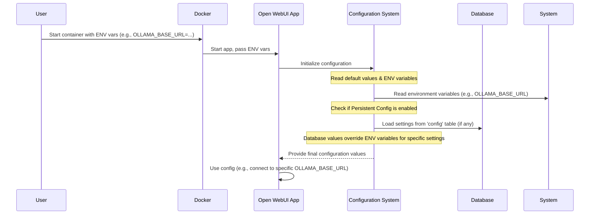

# Chapter 1: Configuration Management

Welcome to the Open WebUI development tutorial! 🎉

Imagine you just got a new gadget, like a smart speaker. Before you use it, you probably want to connect it to your Wi-Fi, maybe link your music streaming account, or adjust the volume settings. Configuration Management in Open WebUI is very similar – it's the **control panel** for the entire application.

## What's the Point? Why Configure?

Open WebUI is designed to be flexible. Maybe you want it to talk to a specific AI model running on your own computer, or perhaps you need to use a special API key for an online AI service. You might want to enable or disable features like web searching or document retrieval (RAG).

Configuration Management allows you, or the person setting up Open WebUI, to easily change these settings without needing to modify the core code. It makes the application adaptable to many different situations and needs.

**Use Case:** Let's say you want Open WebUI to connect to an Ollama instance running on a different computer on your network instead of the default one. How do you tell Open WebUI where Ollama is? That's where configuration comes in!

## The Control Knobs: How Settings are Managed

Open WebUI uses a few different ways to manage its settings, working together like layers:

1.  **Environment Variables:**
    *   **Analogy:** Think of these like sticky notes you attach to the application right when it starts up. They are simple text-based settings (like `KEY=VALUE`).
    *   **How they're set:** Often, when using Docker (a popular way to run applications like Open WebUI), you define these variables in a configuration file (like `docker-compose.yaml`) or directly in the command line when starting the container.
    *   **Example:** Setting `OLLAMA_BASE_URL=http://192.168.1.100:11434` tells Open WebUI where to find your Ollama service.

2.  **Command-Line Arguments:**
    *   **Analogy:** These are like quick instructions you shout at the application just as it begins running.
    *   **How they're set:** Passed directly when starting the application from a terminal. (Less common for typical users compared to environment variables, especially with Docker).

3.  **Database (`config` table):**
    *   **Analogy:** This is like a built-in settings menu within the application itself, storing preferences more permanently.
    *   **How it works:** Open WebUI has a special table in its database named `config`. Settings changed through the Admin interface (like default UI settings or enabling/disabling certain features dynamically) are saved here. These database settings often *override* the initial environment variables for specific configurations that are designed to be changeable while the app is running.

These methods provide flexibility: set initial, fundamental settings with environment variables, and fine-tune or change others later via the database (Admin UI).

## Setting Things Up: A Practical Look

Let's solve our use case: telling Open WebUI to use an Ollama instance at `http://192.168.1.100:11434`.

If you're using Docker Compose (a common method described in the project), you'd edit the `docker-compose.yaml` file. Look for the `open-webui` service and its `environment:` section.

```yaml
# File: docker-compose.yaml (Simplified)
services:
  # ... (ollama service might be here) ...

  open-webui:
    # ... (other settings) ...
    environment:
      # Tell Open WebUI where Ollama is! Change this value.
      - 'OLLAMA_BASE_URL=http://192.168.1.100:11434' 
      # You might need a secret key for security
      - 'WEBUI_SECRET_KEY=your_very_secret_key_here' 
      # Add other environment variables here...
    ports:
      - 3000:8080 # Map port 3000 on your machine to 8080 inside the container
    # ... (volumes, depends_on, etc.) ...

volumes:
  # ...
```

**Explanation:**

*   We added the line `- 'OLLAMA_BASE_URL=http://192.168.1.100:11434'` under `environment:`.
*   When you restart Open WebUI using this file (`docker compose up -d --build`), Docker passes this "sticky note" (`OLLAMA_BASE_URL`) to the application. Open WebUI reads it on startup and knows where to connect.

Many other settings are defined similarly using environment variables. You can see defaults set in the `Dockerfile`:

```dockerfile
# File: Dockerfile (Snippet)

# ... other setup ...

# Set default environment variables
ENV OLLAMA_BASE_URL="/ollama" \
    OPENAI_API_KEY="" \
    WEBUI_SECRET_KEY="" \
    # Many other settings...

# ... rest of Dockerfile ...

CMD [ "bash", "start.sh"]
```

**Explanation:**

*   The `ENV` lines set default values. If you *don't* provide a value in `docker-compose.yaml` (or via other methods), the application uses these defaults.

For settings managed by the database, you typically interact with them via the Open WebUI Admin settings page after logging in as an administrator. Changes made there are saved to the `config` table.

## Under the Hood: How Open WebUI Reads Settings

When Open WebUI starts, it needs to figure out its configuration. Here’s a simplified step-by-step:



**Code Dive:**

1.  **Reading Environment Variables:** The application often uses Python's standard library to read environment variables set by Docker or the system.
    ```python
    # File: backend/open_webui/env.py (Simplified Concept)
    import os

    # Read the OLLAMA_BASE_URL environment variable.
    # If it's not set, use '/ollama' as a default fallback.
    OLLAMA_BASE_URL_FROM_ENV = os.environ.get("OLLAMA_BASE_URL", "/ollama")

    # Read a boolean flag, defaulting to True if not specified
    WEBUI_AUTH = os.environ.get("WEBUI_AUTH", "True").lower() == "true"

    # Read the secret key, crucial for security if auth is enabled
    WEBUI_SECRET_KEY = os.environ.get("WEBUI_SECRET_KEY", "")

    print(f"Ollama URL from Env: {OLLAMA_BASE_URL_FROM_ENV}")
    print(f"Authentication Enabled: {WEBUI_AUTH}")
    ```
    **Explanation:** `os.environ.get("VAR_NAME", "default")` is a common way to read these "sticky notes".

2.  **Database Interaction (`config` table):** A database model defines the structure for storing configuration.
    ```python
    # File: backend/open_webui/config.py (Simplified)
    from sqlalchemy import JSON, Column, Integer, DateTime, func
    from open_webui.internal.db import Base # Base class for DB models

    # Defines the structure of the 'config' table in the database
    class Config(Base):
        __tablename__ = "config"

        id = Column(Integer, primary_key=True) # Unique ID for the config entry
        data = Column(JSON, nullable=False)   # Stores the configuration data as JSON
        # ... other columns like version, created_at, updated_at ...

    # Function to load the latest config from the database
    def get_config_from_db():
        # ... (Database session logic) ...
        # Query the database for the most recent 'Config' entry
        config_entry = db.query(Config).order_by(Config.id.desc()).first()
        return config_entry.data if config_entry else None # Return the JSON data
    ```
    **Explanation:** This code defines how configuration data looks when stored in the database using SQLAlchemy (which we'll cover more in [Database & Models (SQLAlchemy/Peewee)](02_database___models__sqlalchemy_peewee_.md)). The `get_config_from_db` function retrieves the stored settings.

3.  **Combining Sources (`PersistentConfig`):** The `PersistentConfig` class cleverly manages the layering. It first looks at the environment variable, but then checks the database config. If a value exists in the database for that setting (and persistent config is enabled), the database value takes precedence.
    ```python
    # File: backend/open_webui/config.py (Simplified Concept)
    import os

    # A special class to manage configuration values
    class PersistentConfig:
        def __init__(self, env_name, config_path, env_value):
            self.env_name = env_name         # e.g., "OLLAMA_BASE_URLS"
            self.config_path = config_path   # e.g., "ollama.base_urls" (path in JSON)
            self.env_value = env_value       # Value from environment variable

            # Try to get the value from the database config first
            db_value = get_config_value(config_path) # Checks the loaded DB config

            # If found in DB, use it; otherwise, use the environment value
            if db_value is not None:
                 self.value = db_value
                 print(f"{env_name} loaded from Database!")
            else:
                 self.value = env_value
                 print(f"{env_name} using Environment Variable value.")

    # Example Usage:
    # Get OLLAMA_BASE_URLS from environment, split by ';'
    ollama_urls_from_env = [url.strip() for url in os.environ.get("OLLAMA_BASE_URLS", "").split(";")]

    # Create a PersistentConfig instance. It will check the DB under 'ollama.base_urls'
    # and use that if available, otherwise it uses ollama_urls_from_env.
    OLLAMA_BASE_URLS = PersistentConfig(
        "OLLAMA_BASE_URLS", "ollama.base_urls", ollama_urls_from_env
    )

    # Later in the code, access the final value via OLLAMA_BASE_URLS.value
    print(f"Final Ollama URLs to use: {OLLAMA_BASE_URLS.value}")
    ```
    **Explanation:** This class handles the logic: "Check the database first, then fall back to the environment variable." This allows settings changed in the Admin UI to override the initial startup configuration.

4.  **API for Admin UI:** The file `backend/open_webui/routers/configs.py` defines the web API endpoints that the frontend Admin settings page talks to. When an admin saves changes, these endpoints call functions like `save_config` (in `config.py`) to update the `config` table in the database.

## Conclusion

Configuration Management is the system that makes Open WebUI flexible and customizable. By using environment variables (often via Docker) for initial setup and a database table for dynamic changes via the Admin UI, you can tailor the application to your specific needs – from pointing it to different AI models to enabling features.

Understanding how configuration works is the first step to mastering Open WebUI development. These settings often interact with other core parts of the system, like the database itself, which stores much more than just configuration.

In the next chapter, we'll explore how Open WebUI stores and manages user data, chat histories, model settings, and more using its [Database & Models (SQLAlchemy/Peewee)](02_database___models__sqlalchemy_peewee_.md).

---

Generated by [AI Codebase Knowledge Builder](https://github.com/The-Pocket/Tutorial-Codebase-Knowledge)