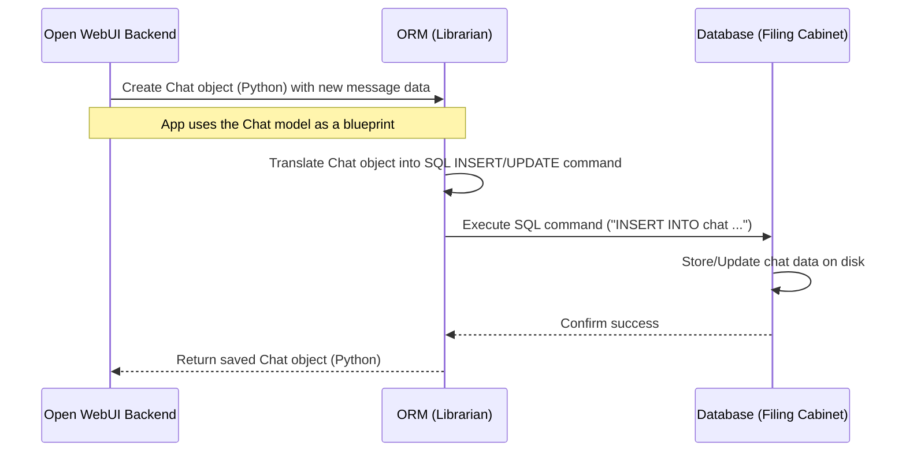

# Chapter 2: Database & Models (SQLAlchemy/Peewee)

Welcome back! In [Chapter 1: Configuration Management](01_configuration_management.md), we learned how Open WebUI gets its initial instructions and settings, like which AI service to connect to. We even saw that some settings can be stored permanently in a database. But what *is* this database, and how does the application remember things like your conversations, user account details, or custom prompts?

That's where the database and models come in – they act as the **application's long-term memory**.

## Why Does Open WebUI Need a Memory?

Imagine chatting with an AI assistant. You close the browser tab and come back later. You'd expect your previous conversations to still be there, right? Without a memory, everything would be forgotten as soon as the application restarts or you close your session.

Open WebUI needs to remember things like:

*   **User Accounts:** Who can log in, their names, passwords (securely stored!), and roles.
*   **Chat Histories:** All the messages you've exchanged with the AI.
*   **Custom Prompts:** Shortcuts or templates you've saved.
*   **Model Configurations:** Settings specific to different AI models you use.
*   **Knowledge Bases (RAG):** Documents you've uploaded for the AI to reference (more on this in [Retrieval Augmented Generation (RAG)](06_retrieval_augmented_generation__rag_.md)).

**Use Case:** Let's say you just finished a chat about planning a trip to Japan. You want to close Open WebUI now and find that chat again tomorrow. How does Open WebUI save your chat and let you retrieve it later?

## The Filing Cabinet: The Database

The **database** is like a digital filing cabinet where Open WebUI stores all this persistent information. It's designed to keep data safe and organized, even when the application isn't running.

Open WebUI can use different types of databases, like:

*   **SQLite:** A simple file-based database, great for single-user setups or development (it's often the default). Think of it as a single, self-contained filing cabinet drawer.
*   **PostgreSQL:** A more powerful, robust database suitable for multiple users and larger amounts of data. Think of it as a large, dedicated room full of filing cabinets.

You usually tell Open WebUI which database to use and where it is via configuration (like the `DATABASE_URL` environment variable we saw in Chapter 1).

## The Blueprints: Models

Okay, we have a filing cabinet (the database). But how do we know what kind of information goes into each file, and how it should be structured? That's where **Models** come in.

Models are like **blueprints** that define the structure of the data we want to store. They are defined in Python code using classes.

**Analogy:** Imagine you want to store information about users. The `User` model is the blueprint specifying that each user record *must* have a unique ID, a name, an email address, and a role (like 'admin' or 'user').

```python
# File: backend/open_webui/models/users.py (Simplified Concept)
from sqlalchemy import Column, String, Text, BigInteger
from open_webui.internal.db import Base # The base blueprint class

# This class is the blueprint for the 'user' table in the database
class User(Base):
    __tablename__ = "user" # The name of the filing cabinet drawer (table)

    # These are the fields each user record will have:
    id = Column(String, primary_key=True) # Unique ID for the user
    name = Column(String)                 # User's display name
    email = Column(String)                # User's email address
    role = Column(String)                 # e.g., 'admin', 'user', 'pending'
    profile_image_url = Column(Text)      # URL to their profile picture
    created_at = Column(BigInteger)       # When the account was created
    # ... other fields like api_key, settings ...
```

**Explanation:**

*   This Python class `User` defines the structure for storing user data.
*   It inherits from `Base`, a standard component provided by the ORM.
*   `__tablename__ = "user"` tells the ORM that this blueprint corresponds to a database table named `user`.
*   Each attribute like `id`, `name`, `email` uses `Column` to define a field in the table, specifying the type of data it holds (String, Text, BigInteger for numbers/timestamps).

Open WebUI has many such models for different types of data: `Chat`, `Prompt`, `Document`, `Model`, etc. You can find them in the `backend/open_webui/models/` directory.

## The Librarian/Translator: The ORM (SQLAlchemy/Peewee)

We have Python code (our application logic and models) and a database (the filing cabinet, which usually understands a language called SQL). How do they talk to each other? We could write SQL queries directly in our Python code, but that can get messy and database-specific.

This is where an **Object-Relational Mapper (ORM)** comes in. The ORM acts like a helpful **librarian or translator**.

*   You give the ORM a Python object (like a `User` object with name and email).
*   The ORM, knowing the blueprint (the `User` model), translates your request into the correct SQL command (like `INSERT INTO user (id, name, email, ...) VALUES (...)`).
*   It sends the SQL command to the database.
*   When you ask for data, the ORM fetches the raw data from the database (using SQL like `SELECT * FROM user WHERE id = ...`).
*   It then translates that raw data back into nice Python objects you can easily use in your code.

Open WebUI primarily uses **SQLAlchemy** as its main ORM. You might also see references to **Peewee**, which was used in earlier stages, especially for managing initial database structure changes. Think of SQLAlchemy as the main librarian now, while Peewee is like an older system that helped set up the initial filing structure.

## Rearranging the Filing Cabinet: Migrations (Alembic/Peewee)

What happens when we need to change the structure of our data? Maybe we want to add a new field to the `User` blueprint, like a phone number. If we just change the Python model code, the database table (the filing cabinet drawer) won't match anymore!

**Migrations** are tools that help manage these changes to the database structure over time. They are like sets of instructions for rearranging the filing cabinet.

*   You change your Python model (the blueprint).
*   You use a migration tool to automatically generate a "migration script". This script contains the specific SQL commands needed to update the database structure (e.g., `ALTER TABLE user ADD COLUMN phone_number VARCHAR;`).
*   When Open WebUI starts or when instructed, it runs these migration scripts to ensure the database structure matches the latest blueprints (models).

Open WebUI uses:

*   **Peewee-Migrate:** For historical migrations, reflecting the earlier use of Peewee. You'll see these in `backend/open_webui/internal/migrations/`.
*   **Alembic:** For current and future migrations based on the SQLAlchemy models. You'll find these in `backend/open_webui/migrations/versions/`.

This ensures that as the application evolves, the database structure evolves with it smoothly.

## Solving the Use Case: Saving and Retrieving a Chat

Let's revisit our use case: saving a chat about Japan and retrieving it later.

1.  **Saving:**
    *   When you finish your chat, the backend might have a Python object representing the chat (perhaps using a Pydantic model for API validation, then converted).
    *   It uses the `Chat` SQLAlchemy model (the blueprint) and tells SQLAlchemy (the librarian) to save it.
    *   SQLAlchemy generates an `INSERT INTO chat (...) VALUES (...)` SQL command.
    *   The database stores the new chat record.

2.  **Retrieving:**
    *   When you open Open WebUI later, the backend asks SQLAlchemy for your chat list.
    *   SQLAlchemy generates a `SELECT id, title, updated_at FROM chat WHERE user_id = 'your_user_id' ORDER BY updated_at DESC` SQL command.
    *   The database sends back the raw data for your chats.
    *   SQLAlchemy translates this raw data back into a list of Python `Chat` objects.
    *   The backend sends this list to the frontend, where you see your "Japan Trip Planning" chat.

## Under the Hood: How it Works

Let's trace the process of saving a new chat message.



**Code Dive:**

1.  **Database Connection (`internal/db.py`):** This file sets up the connection to the database specified by `DATABASE_URL`. It creates the `engine` (the connection pool) and `SessionLocal` (for creating database sessions/conversations). It also defines the `Base` class that all SQLAlchemy models inherit from. You'll also see the `handle_peewee_migration` function here, ensuring older Peewee migrations run before Alembic/SQLAlchemy takes over.

    ```python
    # File: backend/open_webui/internal/db.py (Simplified Concept)
    from sqlalchemy import create_engine
    from sqlalchemy.orm import sessionmaker, scoped_session
    from sqlalchemy.ext.declarative import declarative_base
    from open_webui.env import DATABASE_URL # Get DB location from config

    # Create the engine: manages connections to the database
    # Logic handles SQLite vs PostgreSQL differences and connection pooling
    if "sqlite" in DATABASE_URL:
        engine = create_engine(
            DATABASE_URL, connect_args={"check_same_thread": False} # Specific SQLite setting
        )
    else:
        engine = create_engine(DATABASE_URL, pool_pre_ping=True, ...) # For PostgreSQL, etc.

    # Create a factory for database sessions (conversations)
    SessionLocal = sessionmaker(autocommit=False, autoflush=False, bind=engine)

    # Base class for all our SQLAlchemy models (blueprints)
    Base = declarative_base()

    # Helper to get a session in API endpoints
    def get_db():
        db = SessionLocal()
        try:
            yield db # Provide the session
        finally:
            db.close() # Ensure the session is closed
    ```
    **Explanation:** This code sets up the core machinery SQLAlchemy uses to talk to the database defined in your configuration. `get_db` is a helper function used by API endpoints to get a database session.

2.  **Chat Model (`models/chats.py`):** This defines the blueprint for a chat.

    ```python
    # File: backend/open_webui/models/chats.py (Simplified Concept)
    from sqlalchemy import Column, String, Text, BigInteger, Boolean, JSON
    from open_webui.internal.db import Base # Import the base blueprint

    class Chat(Base):
        __tablename__ = "chat"

        id = Column(String, primary_key=True)
        user_id = Column(String)
        title = Column(Text)
        # Store the actual chat messages and metadata as JSON
        chat = Column(JSON)
        created_at = Column(BigInteger)
        updated_at = Column(BigInteger)
        # ... other fields like share_id, archived, pinned, meta ...
    ```
    **Explanation:** This is the SQLAlchemy blueprint for the `chat` table, defining its columns and data types. The `chat` column uses `JSON` to store potentially complex, nested message data.

3.  **Saving Data (Conceptual Example):** Somewhere in the backend logic (often triggered by an API call from the frontend), code like this might run:

    ```python
    # File: backend/open_webui/models/chats.py (Simplified insert_new_chat)
    import uuid
    import time
    from open_webui.internal.db import get_db # Get a DB session
    from . import Chat # Import the Chat blueprint

    def insert_new_chat(user_id: str, chat_data: dict) -> Chat:
        with get_db() as db: # Start a database conversation
            new_chat_id = str(uuid.uuid4())
            timestamp = int(time.time())

            # Create a new Chat instance based on the blueprint
            db_chat = Chat(
                id=new_chat_id,
                user_id=user_id,
                title=chat_data.get("title", "New Chat"),
                chat=chat_data, # Store the whole chat structure as JSON
                created_at=timestamp,
                updated_at=timestamp,
            )

            # Tell the librarian (SQLAlchemy session) to stage the save
            db.add(db_chat)
            # Commit the changes to the filing cabinet (database)
            db.commit()
            # Refresh the object with any DB-generated defaults (optional)
            db.refresh(db_chat)
            return db_chat # Return the saved chat object
    ```
    **Explanation:** This function takes user ID and chat data, creates a Python `Chat` object following the blueprint, adds it to the database session (`db.add`), and then saves it permanently (`db.commit`).

4.  **Migrations (`migrations/versions/` or `internal/migrations/`):** These files contain the instructions for changing the database structure.

    *   **Alembic Example (SQLAlchemy):**
        ```python
        # File: backend/open_webui/migrations/versions/some_revision_id.py (Simplified)
        """Add a pinned column to chat table"""
        from alembic import op
        import sqlalchemy as sa

        revision = 'some_revision_id'
        down_revision = 'previous_revision_id' # Link to the previous migration

        def upgrade():
            # Add the 'pinned' column to the 'chat' table
            op.add_column('chat', sa.Column('pinned', sa.Boolean(), nullable=True, default=False))

        def downgrade():
            # Instructions to undo the change (remove the column)
            op.drop_column('chat', 'pinned')
        ```
        **Explanation:** The `upgrade` function tells Alembic how to add the `pinned` column. The `downgrade` function tells it how to reverse the change if needed.

    *   **Peewee Example (Historical):**
        ```python
        # File: backend/open_webui/internal/migrations/002_add_local_sharing.py (Simplified)
        """Peewee migrations -- Add share_id column"""
        import peewee as pw
        from peewee_migrate import Migrator

        def migrate(migrator: Migrator, database: pw.Database, *, fake=False):
            # Add the 'share_id' field to the 'chat' model (table)
            migrator.add_fields(
                'chat',
                share_id=pw.CharField(max_length=255, null=True, unique=True)
            )

        def rollback(migrator: Migrator, database: pw.Database, *, fake=False):
            # Instructions to undo the change
            migrator.remove_fields('chat', 'share_id')
        ```
        **Explanation:** Similar concept, but using Peewee's `migrator` object to define the changes (`add_fields`, `remove_fields`).

## Conclusion

The database is Open WebUI's memory, storing everything from user accounts to chat histories. Models (like `User`, `Chat`) act as Python blueprints defining how this data is structured. The ORM (SQLAlchemy) is the translator that lets our Python code interact with the database easily, without writing raw SQL. Migrations (Alembic/Peewee) handle updates to the database structure as the application evolves.

Understanding how data is stored is crucial for understanding how features like chat history, user profiles, and custom prompts work. This persistent data is often used in conjunction with the core AI logic.

In the next chapter, we'll dive into how Open WebUI connects to and interacts with the actual Large Language Models (LLMs) like Ollama or OpenAI services: [LLM Integration (Ollama/OpenAI)](03_llm_integration__ollama_openai_.md).

---

Generated by [AI Codebase Knowledge Builder](https://github.com/The-Pocket/Tutorial-Codebase-Knowledge)