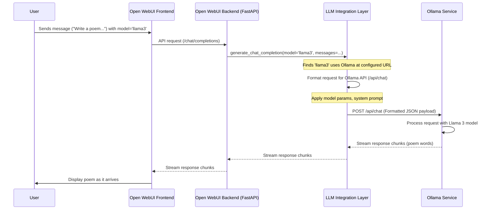

# Chapter 3: LLM Integration (Ollama/OpenAI)

Welcome back! In [Chapter 2: Database & Models (SQLAlchemy/Peewee)](02_database___models__sqlalchemy_peewee_.md), we saw how Open WebUI remembers things like your chat history using its database "memory". But how does Open WebUI actually *talk* to the AI brains, the Large Language Models (LLMs) like Llama 3 or GPT-4?

That's what this chapter is about! The LLM Integration layer is like Open WebUI's **universal translator and telephone switchboard** for communicating with different AI services.

## Why Do We Need a Translator and Switchboard?

Imagine you want to call friends in different countries. One might use a standard phone line, another might prefer WhatsApp calls, and a third might only use a specific satellite phone service. You wouldn't use the same method to contact all of them, and you might need to speak different languages or follow different dialing procedures.

LLMs are similar. They live in different places and speak slightly different "languages" (APIs):

1.  **Ollama:** This lets you run LLMs (like Llama 3, Mistral, etc.) on your own computer or server. It has its own way of receiving requests and sending back answers.
2.  **OpenAI API:** This service (and others compatible with it, like Groq, Together AI, or local servers like LiteLLM) lets you use models like GPT-4. It has a different standard format for requests and responses.
3.  **Others:** There are many other ways to run or access LLMs!

Open WebUI needs a way to:

*   **Know which service to contact:** Based on the model you selected in the interface.
*   **Format the request correctly:** Translate your message and settings into the specific format the chosen service understands.
*   **Handle authentication:** Use the right API keys or credentials if needed.
*   **Send the request:** Make the actual network call to the LLM service.
*   **Process the response:** Understand the answer (which might come back piece-by-piece, like streaming text) and display it nicely.

**Use Case:** You type "Write a short poem about a cat" into Open WebUI and select the "Llama 3" model (which you're running via Ollama). How does Open WebUI send this request specifically to your local Ollama service and display the poem as it's being written?

## The Core Concepts: Switchboard, Translator, Messenger

Let's break down how the LLM Integration layer works:

1.  **The Switchboard (Model Routing):**
    *   **Analogy:** Like an old-time telephone operator connecting your call to the right destination.
    *   **How it works:** When you select a model (e.g., `llama3` or `gpt-4-turbo`) in the Open WebUI interface, the backend looks up information about that model (often stored in the database, as we saw in [Chapter 2: Database & Models (SQLAlchemy/Peewee)](02_database___models__sqlalchemy_peewee_.md)). This information tells Open WebUI *which* service runs this model (e.g., "this `llama3` is on Ollama at `http://localhost:11434`" or "this `gpt-4-turbo` uses the OpenAI API at `https://api.openai.com/v1`"). It uses configuration details (like `OLLAMA_BASE_URLS` from [Chapter 1: Configuration Management](01_configuration_management.md)) to know the exact addresses.

2.  **The Translator (Payload Formatting):**
    *   **Analogy:** Translating your English request into the specific dialect or language the receiving phone operator understands.
    *   **How it works:** Different services expect the chat history, your message, and settings (like temperature or max tokens) in different formats (often JSON structures). The integration layer takes the standard internal representation of your request and converts it into the specific JSON payload required by Ollama, OpenAI, or another compatible API. It also injects any necessary API keys.

3.  **The Messenger (Sending & Receiving):**
    *   **Analogy:** Making the phone call and listening for the response.
    *   **How it works:** Using libraries like `aiohttp` (for asynchronous requests), the integration layer sends the formatted request over the network to the correct LLM service endpoint (e.g., `/api/chat` for Ollama or `/v1/chat/completions` for OpenAI). It then waits for the response.

4.  **Response Handling (Streaming & Parsing):**
    *   **Analogy:** Understanding the person on the other end, whether they speak slowly (streaming) or give the whole answer at once.
    *   **How it works:** LLMs often "stream" their responses, sending back text word by word or sentence by sentence. This allows Open WebUI to display the answer as it's generated, providing a better user experience. The integration layer handles these streaming responses (often using `StreamingResponse` in FastAPI), processing each chunk as it arrives. If the response isn't streamed, it waits for the complete answer and processes it. It might also need to translate the response format back (e.g., converting an Ollama response structure to a more standard internal format if needed).

## Solving the Use Case: Asking Llama 3 for a Poem

Let's trace our request: "Write a short poem about a cat" using the `llama3` model via Ollama.

1.  **You Send:** You type the message and hit send in the Open WebUI frontend.
2.  **Backend Receives:** The Open WebUI backend (specifically a FastAPI endpoint, which we'll cover in [Chapter 4: Backend API & Routing (FastAPI)](04_backend_api___routing__fastapi_.md)) receives the request, including the message, chat history, and the selected model ID (`llama3`).
3.  **Switchboard:** The LLM Integration layer checks the `llama3` model details. It finds that this model is served by Ollama at the configured `OLLAMA_BASE_URL` (e.g., `http://localhost:11434`).
4.  **Translator:** It takes your message ("Write a short poem..."), the previous chat history, and any custom model parameters (like temperature, from the database or defaults) and formats them into the JSON structure Ollama expects for its `/api/chat` endpoint.
5.  **Messenger:** It sends this JSON payload as an HTTP POST request to `http://localhost:11434/api/chat`.
6.  **Ollama:** Your local Ollama service receives the request, passes it to the Llama 3 model, and starts getting the response (the poem).
7.  **Response Handling:** Ollama streams the poem back piece by piece. The LLM Integration layer receives these chunks. Since the request likely asked for streaming, it uses FastAPI's `StreamingResponse` to forward these chunks back to your browser almost immediately.
8.  **Frontend Displays:** The Open WebUI frontend receives the streaming chunks and updates the chat window, showing the poem as it's being generated.

## Under the Hood: Implementation Details

Let's see how this looks in the code, simplified for clarity.

**Sequence Diagram:**



**Code Dive:**

1.  **Routing the Request (`utils/chat.py`):** The main entry point often determines *which* integration path to take (Ollama, OpenAI, etc.) based on the model's `owned_by` property.

    ```python
    # File: backend/open_webui/utils/chat.py (Simplified generate_chat_completion)
    import json
    from fastapi import Request, HTTPException
    from starlette.responses import StreamingResponse

    # Import functions from specific router modules
    from open_webui.routers.ollama import generate_chat_completion as generate_ollama_chat_completion
    from open_webui.routers.openai import generate_chat_completion as generate_openai_chat_completion
    from .payload import convert_payload_openai_to_ollama # Translator helper
    from .response import convert_streaming_response_ollama_to_openai # Response translator

    async def generate_chat_completion(request: Request, form_data: dict, user: Any):
        models = request.app.state.MODELS # Get loaded model info
        model_id = form_data["model"]

        if model_id not in models:
            raise HTTPException(status_code=404, detail="Model not found")

        model = models[model_id]

        # *** The Switchboard Logic ***
        if model.get("owned_by") == "ollama":
            # Translate payload to Ollama format
            ollama_form_data = convert_payload_openai_to_ollama(form_data)

            # Call the Ollama-specific function
            response = await generate_ollama_chat_completion(
                request=request, form_data=ollama_form_data, user=user
            )

            # If streaming, translate Ollama's stream format back to OpenAI's
            if ollama_form_data.get("stream"):
                return StreamingResponse(
                    convert_streaming_response_ollama_to_openai(response),
                    media_type="text/event-stream",
                    background=response.background,
                )
            else:
                # Translate non-streaming response (less common for chat)
                # return convert_response_ollama_to_openai(response)
                return response # Simplified for example

        elif model.get("owned_by") == "openai":
            # Call the OpenAI-specific function
            # Payload is already in OpenAI format (mostly)
            return await generate_openai_chat_completion(
                request=request, form_data=form_data, user=user
            )
        else:
            # Handle other types (like functions/pipelines, covered later)
            # ...
            raise HTTPException(status_code=500, detail="Unsupported model owner")

    ```
    **Explanation:** This function acts as the initial switchboard. It checks the `owned_by` field of the selected model. If it's `ollama`, it prepares the data for Ollama and calls `generate_ollama_chat_completion`. If it's `openai`, it calls `generate_openai_chat_completion`. It also handles translating payloads and responses if needed.

2.  **Sending the Request (Ollama Example - `routers/ollama.py`):** This file contains the logic specific to talking to Ollama.

    ```python
    # File: backend/open_webui/routers/ollama.py (Simplified send_post_request & chat)
    import aiohttp
    import json
    from fastapi import Request, HTTPException, Depends
    from fastapi.responses import StreamingResponse
    from starlette.background import BackgroundTask

    # Simplified helper to clean up network connections
    async def cleanup_response(response, session):
        if response: response.close()
        if session: await session.close()

    # Simplified function to send POST requests
    async def send_post_request(url: str, payload: str, stream: bool = True, key: str = None, user = None):
        session = None
        response = None
        try:
            session = aiohttp.ClientSession(trust_env=True) # Create a session to make requests
            headers = {"Content-Type": "application/json"}
            if key: headers["Authorization"] = f"Bearer {key}"
            # Add user info headers if enabled (omitted for simplicity)

            response = await session.post(url, data=payload, headers=headers)
            response.raise_for_status() # Check for HTTP errors (like 404 Not Found)

            if stream:
                # Return a streaming response that forwards Ollama's stream
                return StreamingResponse(
                    response.content, # Pass the raw content stream
                    status_code=response.status,
                    headers=dict(response.headers),
                    background=BackgroundTask(cleanup_response, response=response, session=session)
                )
            else:
                # Handle non-streaming response
                res_json = await response.json()
                await cleanup_response(response, session)
                return res_json
        except Exception as e:
            # Simplified error handling
            await cleanup_response(response, session)
            detail = f"Ollama Error: {e}"
            raise HTTPException(status_code=getattr(response, 'status', 500), detail=detail)

    # Simplified chat endpoint function
    async def generate_chat_completion(request: Request, form_data: dict, user, bypass_filter: bool = False):
        # ... (Code to get model_info, apply params/system prompt - see files) ...
        payload = form_data
        model_id = payload["model"] # e.g., "llama3:latest"

        # Determine the correct Ollama URL (handles multiple Ollama instances)
        url, url_idx = await get_ollama_url(request, model_id) # Helper finds URL for this model
        api_key = get_api_key(url_idx, url, request.app.state.config.OLLAMA_API_CONFIGS)

        # Send the request using the helper function
        return await send_post_request(
            url=f"{url}/api/chat", # Specific Ollama endpoint
            payload=json.dumps(payload), # Convert Python dict to JSON string
            stream=payload.get("stream", True),
            key=api_key,
            user=user,
        )
    ```
    **Explanation:**
    *   `generate_chat_completion` gets the specific Ollama URL for the requested model using `get_ollama_url` (which uses config from Chapter 1) and any required API key.
    *   It then calls `send_post_request`, passing the URL, the JSON payload, and indicating whether streaming is expected.
    *   `send_post_request` uses `aiohttp` to make the actual network call. For streaming, it cleverly returns a `StreamingResponse` that directly pipes the content from Ollama back to the user's browser via the Open WebUI backend.

3.  **Payload Translation (`utils/payload.py`):** If the source and target APIs use different formats, helper functions translate between them.

    ```python
    # File: backend/open_webui/utils/payload.py (Simplified conversion)

    def convert_messages_openai_to_ollama(messages: list[dict]) -> list[dict]:
        # Ollama expects images as a list of base64 strings in the 'images' key
        # OpenAI puts them inside the 'content' list.
        ollama_messages = []
        for msg in messages:
            new_msg = {"role": msg["role"], "content": ""}
            images = []
            content_parts = msg.get("content", [])

            if isinstance(content_parts, str):
                new_msg["content"] = content_parts # Simple text message
            elif isinstance(content_parts, list):
                text_content = ""
                for part in content_parts:
                    if part.get("type") == "text":
                        text_content += part.get("text", "")
                    elif part.get("type") == "image_url":
                        img_url = part.get("image_url", {}).get("url", "")
                        if img_url.startswith("data:"): # Base64 image data
                            images.append(img_url.split(",")[-1]) # Extract base64 part
                new_msg["content"] = text_content
                if images:
                    new_msg["images"] = images
            # Handle tool calls (simplified)
            elif msg.get("tool_calls"):
                 new_msg["tool_calls"] = msg["tool_calls"] # Assume format is similar enough for example

            ollama_messages.append(new_msg)
        return ollama_messages

    def convert_payload_openai_to_ollama(openai_payload: dict) -> dict:
        # Main conversion function
        ollama_payload = {
            "model": openai_payload.get("model"),
            "messages": convert_messages_openai_to_ollama(openai_payload.get("messages", [])),
            "stream": openai_payload.get("stream", False),
            # Convert other parameters like 'options', 'format', 'keep_alive'
            # ... (see full file for details) ...
        }
        # Map OpenAI params like 'max_tokens' to Ollama's 'num_predict' if in options
        if options := openai_payload.get("options"):
             ollama_payload["options"] = options.copy()
             if "max_tokens" in ollama_payload["options"]:
                 ollama_payload["options"]["num_predict"] = ollama_payload["options"].pop("max_tokens")
        return ollama_payload
    ```
    **Explanation:** These functions carefully restructure the message list and parameters. For example, `convert_messages_openai_to_ollama` handles the different way OpenAI and Ollama represent images within messages. `convert_payload_openai_to_ollama` orchestrates the overall translation, including parameter names like `max_tokens` (OpenAI) vs. `num_predict` (Ollama).

4.  **Applying Model Parameters (`utils/payload.py`):** Before sending, parameters defined in the model's settings (from the database, Chapter 2) are merged into the payload.

    ```python
    # File: backend/open_webui/utils/payload.py (Simplified param application)

    # Example for Ollama
    def apply_model_params_to_body_ollama(params: dict, form_data: dict) -> dict:
        if not params: return form_data
        if "options" not in form_data: form_data["options"] = {}

        # Map known parameters from DB settings ('params') to Ollama 'options'
        ollama_option_keys = ["temperature", "top_p", "num_predict", "seed", "stop", ...]
        for key in ollama_option_keys:
            if key in params:
                 # Simple assignment, assumes type is correct for example
                 form_data["options"][key] = params[key]

        # Also handle system prompt
        if system_prompt := params.get("system"):
             # (Code to template/add system prompt - see full file)
             form_data["messages"] = add_or_update_system_message(system_prompt, form_data["messages"])

        return form_data

    # Called within router functions like routers/ollama.py/generate_chat_completion
    # ... inside generate_chat_completion ...
    # model_info = Models.get_model_by_id(model_id)
    # if model_info and model_info.params:
    #    db_params = model_info.params.model_dump()
    #    payload = apply_model_params_to_body_ollama(db_params, payload)
    #    payload = apply_model_system_prompt_to_body(db_params, payload, metadata, user)
    # ...
    ```
    **Explanation:** Functions like `apply_model_params_to_body_ollama` take the parameters saved for a specific model (e.g., a specific `temperature` or `system` prompt fetched from the `Models` table) and merge them into the final request payload (`form_data`) before it's sent to the LLM service. This ensures model-specific settings are respected.

## Conclusion

The LLM Integration layer is a vital part of Open WebUI, acting as the intermediary between the user interface and the powerful Large Language Models. It functions as a **switchboard** (directing requests to the correct service like Ollama or OpenAI) and a **translator** (formatting requests and responses according to each service's specific API requirements). It handles configuration details like API endpoints and keys, applies model-specific parameters, and manages the complexities of streaming responses.

By abstracting away the differences between various LLM providers, this layer allows Open WebUI to support a wide range of models flexibly.

Now that we understand how Open WebUI configures itself, stores data, and talks to LLMs, let's look at how the backend organizes its web endpoints to handle requests from the frontend. In the next chapter, we'll explore the [Backend API & Routing (FastAPI)](04_backend_api___routing__fastapi_.md).

---

Generated by [AI Codebase Knowledge Builder](https://github.com/The-Pocket/Tutorial-Codebase-Knowledge)