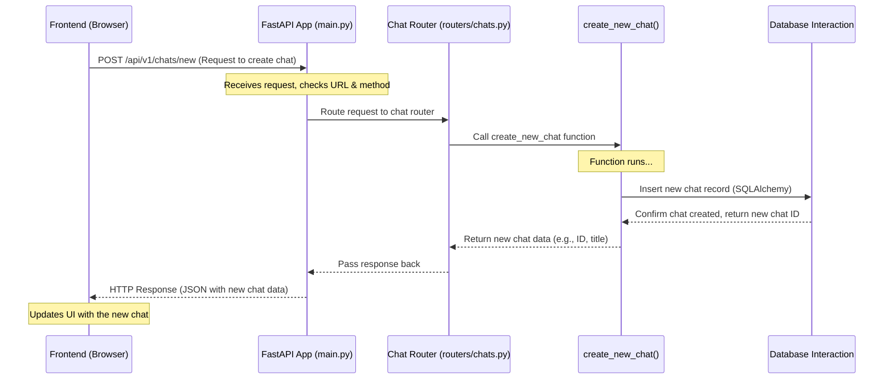

# Chapter 4: Backend API & Routing (FastAPI)

Welcome back! In [Chapter 3: LLM Integration (Ollama/OpenAI)](03_llm_integration__ollama_openai_.md), we saw how Open WebUI acts as a switchboard and translator to talk to different AI models. But how does the frontend (your browser) actually tell the backend *what* it wants to do? How does it ask to start a chat, send a message, or fetch user settings?

This is where the **Backend API & Routing** system comes in, powered by a tool called **FastAPI**. Think of it as the **restaurant's order system and kitchen manager**. It takes orders from the customer (frontend), figures out which kitchen station needs to handle it, and ensures the dish (response) gets made and sent back correctly.

## Why Do We Need an Order System? (Motivation)

Imagine a busy restaurant without an organized system. Waiters shouting orders, chefs grabbing random ingredients – it would be chaos! Similarly, the Open WebUI backend needs a structured way to handle requests from the frontend.

*   The frontend needs a clear way to ask for specific actions (like "create a new chat" or "get my user profile").
*   The backend needs to understand these requests and direct them to the correct piece of code that handles that specific action.
*   The backend needs to send back a response in a format the frontend understands.

**Use Case:** Let's say you want to start a new chat in Open WebUI. You click the "New Chat" button. How does the frontend tell the backend to create this new chat session in the database and prepare for your first message?

## The Key Concepts: Manager, Menu, Orders, and Stations

FastAPI helps organize the backend like a well-run restaurant:

1.  **FastAPI (The Kitchen Manager):**
    *   **Analogy:** The overall manager who sets up the restaurant's workflow.
    *   **What it is:** FastAPI is a modern, fast (hence the name!) Python web framework used to build the backend API. It provides the tools to define endpoints, handle incoming requests, validate data, and send back responses. It's the main engine organizing the backend operations.

2.  **API (The Menu):**
    *   **Analogy:** The restaurant's menu listing all the available dishes (actions) the kitchen can prepare.
    *   **What it is:** The Application Programming Interface (API) is a set of defined rules and endpoints that the frontend can use to interact with the backend. It specifies *what* actions are available (e.g., create chat, get models, update user settings) and *how* to request them.

3.  **HTTP Requests (The Orders):**
    *   **Analogy:** The customer placing an order with the waiter.
    *   **What it is:** When your browser (frontend) needs something from the backend, it sends an HTTP request. Common types include:
        *   `GET`: Used to request data (e.g., "Get my chat history").
        *   `POST`: Used to send data to create or update something (e.g., "Create a new chat with this first message").
        *   `DELETE`: Used to request deletion (e.g., "Delete this chat").
        *   `PUT` / `PATCH`: Used to update existing data.

4.  **Endpoints/Routes (Specific Menu Items/Order Destinations):**
    *   **Analogy:** Specific items on the menu or the destination URL for an order.
    *   **What it is:** These are specific URLs that the frontend sends requests to. Each endpoint is linked to a specific backend function.
    *   **Example:** `/api/v1/chats/new` might be the endpoint for creating a new chat. `/api/v1/models` might be the endpoint to get the list of available models.

5.  **Routers (Kitchen Stations):**
    *   **Analogy:** Different stations in the kitchen, each specializing in certain types of dishes (e.g., Appetizers, Main Courses, Desserts).
    *   **What it is:** To keep the code organized, FastAPI uses `APIRouter`. Related endpoints are grouped together in separate Python files (routers). Open WebUI has routers for chats (`chats.py`), users (`users.py`), models (`models.py`), configuration (`configs.py`), etc. This makes the codebase easier to manage.

6.  **Request Handlers (The Chefs/Cooks):**
    *   **Analogy:** The specific chef or cook at a station who prepares a particular dish.
    *   **What it is:** These are the actual Python functions decorated with `@router.get(...)` or `@router.post(...)` etc. When a request hits a specific endpoint, FastAPI calls the corresponding handler function to do the work (e.g., interact with the database using concepts from [Chapter 2](02_database___models__sqlalchemy_peewee_.md), talk to an LLM using concepts from [Chapter 3](03_llm_integration__ollama_openai_.md)) and return a response.

## Solving the Use Case: Starting a New Chat

Let's trace how clicking "New Chat" works using FastAPI:

1.  **Frontend Action:** You click the "New Chat" button. The frontend code (likely JavaScript) prepares a request.
2.  **Frontend Sends Order (HTTP POST):** The frontend sends an HTTP `POST` request to the backend endpoint, say `/api/v1/chats/new`. It might include some initial data, like which model you want to use.
3.  **FastAPI Receives Order:** FastAPI, the manager, receives this `POST` request for `/api/v1/chats/new`.
4.  **FastAPI Routes to Station:** FastAPI looks at its routing table and sees that `/api/v1/chats/new` is handled by the "chats" router (`routers/chats.py`).
5.  **Router Directs to Chef:** The "chats" router knows that the `POST` method for the `/new` path corresponds to the `create_new_chat` function (the chef).
6.  **Handler Function Prepares Dish:** The `create_new_chat` function executes. It might:
    *   Validate the incoming data (Is the model ID valid?).
    *   Interact with the database ([Chapter 2](02_database___models__sqlalchemy_peewee_.md)) to create a new chat record for your user ID.
    *   Prepare an initial state for the chat.
7.  **Backend Sends Response:** The `create_new_chat` function finishes and returns data about the newly created chat (like its ID and title). FastAPI packages this into an HTTP response.
8.  **Frontend Receives Confirmation:** The frontend receives the response, knows the chat was created successfully, gets the new chat ID, and updates the UI to show the new, empty chat window.

## Under the Hood: How FastAPI Manages Requests

Let's visualize the flow with a simplified sequence diagram:



**Code Dive:**

1.  **Setting up FastAPI (`main.py`):** This is where the main FastAPI application is created and the different routers (kitchen stations) are plugged in.

    ```python
    # File: backend/open_webui/main.py (Highly Simplified)
    from fastapi import FastAPI
    from open_webui.routers import chats, models, users, configs # Import routers

    # Create the main FastAPI application instance (The Manager)
    app = FastAPI(title="Open WebUI Backend")

    # Include the routers (Plug in the Kitchen Stations)
    # Requests starting with /api/v1/chats will go to the chats router
    app.include_router(chats.router, prefix="/api/v1/chats", tags=["chats"])
    # Requests starting with /api/v1/models will go to the models router
    app.include_router(models.router, prefix="/api/v1/models", tags=["models"])
    # Requests starting with /api/v1/users will go to the users router
    app.include_router(users.router, prefix="/api/v1/users", tags=["users"])
    # ... include other routers like configs, files, etc. ...

    # Simple endpoint to check if the server is running
    @app.get("/health")
    async def healthcheck():
        return {"status": True}

    # ... (Other middleware, startup events, etc.) ...
    ```
    **Explanation:**
    *   `app = FastAPI(...)` creates the main application object.
    *   `app.include_router(chats.router, prefix="/api/v1/chats", ...)` tells FastAPI that any URL starting with `/api/v1/chats` should be handled by the code defined in `routers/chats.py`.

2.  **Defining a Router (`routers/chats.py`):** This file groups all chat-related endpoints.

    ```python
    # File: backend/open_webui/routers/chats.py (Highly Simplified)
    from fastapi import APIRouter, Depends, HTTPException
    from typing import Optional
    from pydantic import BaseModel # For defining expected data shapes

    # Import functions that interact with the database/models
    from open_webui.models.chats import Chats, ChatResponse, ChatForm

    # Import authentication helper
    from open_webui.utils.auth import get_verified_user

    # Create a router instance for chat-related endpoints (The Chat Station)
    router = APIRouter()

    # Define the handler for POST requests to /new (relative to the prefix '/api/v1/chats')
    @router.post("/new", response_model=Optional[ChatResponse])
    async def create_new_chat(
        form_data: ChatForm, # Expect data matching ChatForm structure
        user = Depends(get_verified_user) # Ensure user is logged in
    ):
        # This is the "Chef" function for creating a new chat
        try:
            # Call the function (from models/chats.py) to actually create the chat in the DB
            chat = Chats.insert_new_chat(user.id, form_data)

            # If successful, return the chat data using the ChatResponse model structure
            return ChatResponse(**chat.model_dump())
        except Exception as e:
            # Handle potential errors (e.g., database error)
            print(f"Error creating chat: {e}")
            raise HTTPException(status_code=400, detail="Could not create chat.")

    # Define the handler for GET requests to /{id} (e.g., /api/v1/chats/some-chat-id)
    @router.get("/{id}", response_model=Optional[ChatResponse])
    async def get_chat_by_id(id: str, user = Depends(get_verified_user)):
        # This "Chef" gets a specific chat
        chat = Chats.get_chat_by_id_and_user_id(id, user.id)
        if chat:
            return ChatResponse(**chat.model_dump())
        else:
            # If chat not found or user doesn't have access
            raise HTTPException(status_code=404, detail="Chat not found.")

    # ... (Other chat endpoints like /:id/update, /:id/delete, etc.) ...
    ```
    **Explanation:**
    *   `router = APIRouter()` creates a specific router for chat endpoints.
    *   `@router.post("/new", ...)` is a decorator. It tells FastAPI that the function `create_new_chat` should handle `POST` requests made to `/api/v1/chats/new`.
    *   `form_data: ChatForm` uses Pydantic (often used with FastAPI) to automatically validate that the incoming request body matches the expected structure defined in the `ChatForm` model.
    *   `user = Depends(get_verified_user)` is a powerful FastAPI feature called Dependency Injection. It ensures that this function only runs if the user is properly authenticated, and it makes the user's information available via the `user` variable. We'll cover this more in [Chapter 5: User & Access Management](05_user___access_management.md).
    *   The function body calls `Chats.insert_new_chat` (which handles the database interaction from [Chapter 2](02_database___models__sqlalchemy_peewee_.md)) and returns the result.

3.  **Defining Expected Data (Pydantic Models - e.g., in `models/chats.py`):** These classes define the structure of data expected in requests or sent in responses.

    ```python
    # File: backend/open_webui/models/chats.py (Simplified Pydantic model)
    from pydantic import BaseModel
    from typing import Optional, List, Dict, Any

    # Defines the expected structure for data sent when creating/updating a chat
    class ChatForm(BaseModel):
        chat: Dict[str, Any] # Expects a dictionary containing chat details

    # Defines the structure of the response when fetching a chat
    class ChatResponse(BaseModel):
        id: str
        user_id: str
        title: str
        # ... other fields like created_at, updated_at, chat content ...
    ```
    **Explanation:** FastAPI uses these Pydantic models to:
    *   **Validate incoming data:** If the frontend sends data in a `POST` request that doesn't match `ChatForm`, FastAPI automatically sends back an error.
    *   **Serialize outgoing data:** Ensures the data returned by handler functions (like `create_new_chat`) matches the `ChatResponse` structure before sending it back to the frontend as JSON.

## Conclusion

FastAPI acts as the central nervous system or the kitchen manager for the Open WebUI backend. It receives HTTP requests (orders) from the frontend, uses routers (kitchen stations) to direct these requests to the correct handler functions (chefs), and manages the process of sending back responses (dishes). This organization, using routers and Pydantic models, makes the backend code structured, efficient, and easier to maintain.

Understanding how FastAPI routes requests is key to understanding how different parts of the application communicate. Now that we know how requests are handled, let's look specifically at how users log in and how their access is managed.

Next up: [Chapter 5: User & Access Management](05_user___access_management.md).

---

Generated by [AI Codebase Knowledge Builder](https://github.com/The-Pocket/Tutorial-Codebase-Knowledge)