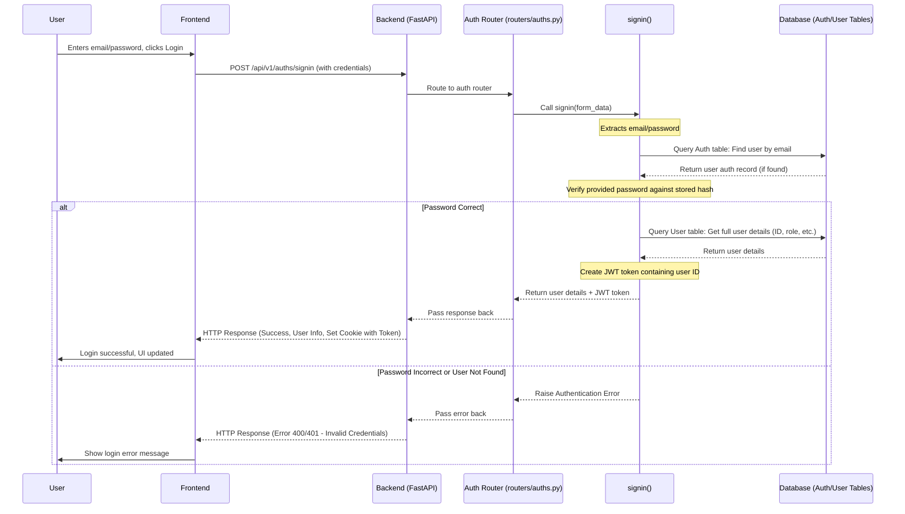
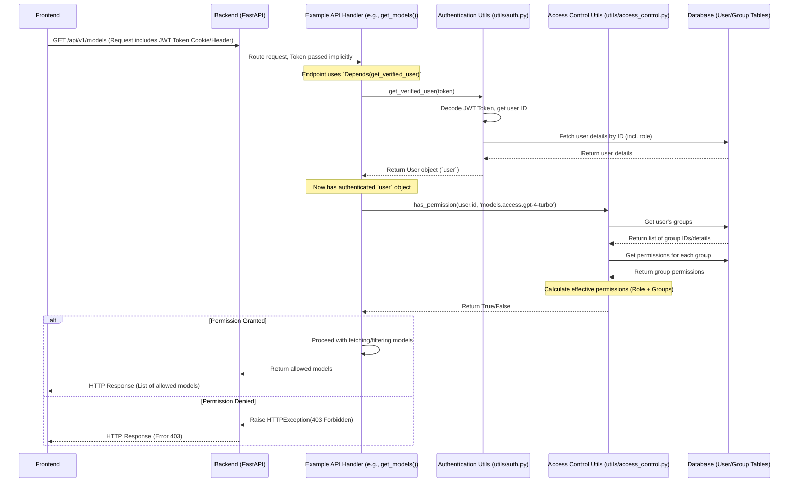

# Chapter 5: User & Access Management

Welcome back! In [Chapter 4: Backend API & Routing (FastAPI)](04_backend_api___routing__fastapi_.md), we learned how the backend uses FastAPI to manage incoming requests, like orders in a restaurant. But how does the restaurant know *who* is placing the order, and whether they're allowed to order from the "Employees Only" menu?

This chapter introduces **User & Access Management**, which acts like Open WebUI's **security guard and receptionist combined**. It handles user accounts, who can log in, what their role is, and precisely what they are allowed to see and do within the application.

## Why Bother with Users and Permissions?

Imagine an Open WebUI setup used by a whole team. Maybe some users should only be able to chat with specific AI models, while others (administrators) need to manage settings and users. Without user management, everyone would have access to everything, which isn't always secure or practical.

User & Access Management allows Open WebUI to:

*   **Identify Users:** Know who is using the application.
*   **Control Access:** Ensure users can only access the features, models, and data they are supposed to.
*   **Personalize Experience:** (Though less of a focus here) User accounts allow saving personal chat history and preferences.

**Use Case:** Let's say an administrator wants to set up Open WebUI so that regular users can only chat with the `llama3` model, but administrators can also use the more powerful (and potentially expensive) `gpt-4-turbo` model. How does Open WebUI enforce this rule?

## The Core Concepts: Who Are You? What Can You Do?

This system combines several ideas to manage users and their capabilities:

1.  **Authentication (The Security Guard):**
    *   **Analogy:** The guard at the building entrance checking your ID before letting you in.
    *   **What it is:** This is the process of **verifying who you are**. Open WebUI needs to make sure you are who you claim to be.
    *   **Methods:**
        *   **Email & Password:** The classic login method.
        *   **OAuth:** "Log in with Google," "Log in with GitHub," etc. You prove your identity via another trusted service.
        *   **LDAP:** Often used in companies to connect to a central user directory.
        *   **Trusted Headers:** An advanced method where a proxy server in front of Open WebUI handles authentication and tells Open WebUI who the user is via special HTTP headers.
    *   **Outcome:** If successful, Open WebUI knows your unique user ID.

2.  **Roles (Your Job Title):**
    *   **Analogy:** Your job title (e.g., Intern, Employee, Manager, CEO) gives a general idea of your responsibilities and access level.
    *   **What it is:** A broad category assigned to each user that defines their general level of privilege.
    *   **Common Roles in Open WebUI:**
        *   `admin`: Full control. Can manage users, models, settings, etc.
        *   `user`: Standard user. Can chat, manage their own history, etc. (specific permissions can be further limited).
        *   `pending`: Signed up but needs admin approval before they can fully use the application.

3.  **Permissions (Your Keycard Access):**
    *   **Analogy:** Your keycard might grant access to specific floors or rooms in the building, but not others.
    *   **What it is:** Fine-grained rules defining **exactly what actions** a user (or role, or group) is allowed to perform.
    *   **Examples:**
        *   Can access `gpt-4-turbo` model? (Yes/No)
        *   Can upload documents to knowledge bases? (Yes/No)
        *   Can view the Admin settings page? (Yes/No)
        *   Can delete other users' chats? (Yes/No)

4.  **Role-Based Access Control (RBAC):**
    *   **Analogy:** The company policy stating that all "Managers" get access to the manager's lounge, while "Interns" do not.
    *   **What it is:** A common strategy where **permissions are assigned based on roles**. Instead of giving each permission to every single user, you assign permissions to roles (`admin`, `user`), and then assign roles to users. This makes management much easier.

5.  **Groups (Project Teams / Departments):**
    *   **Analogy:** You might be an "Employee" (your role), but you're also part of the "Marketing Team" (your group). The Marketing Team might have access to a special meeting room that other employees don't.
    *   **What it is:** A way to bundle users together and assign specific permissions **directly to the group**. This allows for more flexible control beyond just roles. A user can be in multiple groups.
    *   **How it works:** Permissions granted to a group are often *combined* with the permissions from the user's role. If either the role *or* any of the user's groups grants a permission, the user typically has that permission.

## Solving the Use Case: Restricting Model Access

Let's implement our use case: Admins can use `llama3` and `gpt-4-turbo`, while regular users can only use `llama3`.

1.  **Authentication:** Users log in (e.g., using email/password). Open WebUI identifies them and knows their user ID.
2.  **Roles:** The backend checks the user's role stored in the database ([Chapter 2: Database & Models (SQLAlchemy/Peewee)](02_database___models__sqlalchemy_peewee_.md)). Let's say User A is `admin` and User B is `user`.
3.  **Permissions (via RBAC/Groups):**
    *   Open WebUI might be configured (often through environment variables or the admin panel, affecting settings in the `config` table or group permissions) like this:
        *   **Role `admin`:** Allowed models: `*` (all models)
        *   **Role `user`:** Allowed models: `llama3`
    *   Alternatively, an Admin might create a "Basic Users" group, add User B to it, and set the group's permissions to only allow `llama3`.
4.  **Enforcement:** When User A or User B requests the list of available models via the API ([Chapter 4: Backend API & Routing (FastAPI)](04_backend_api___routing__fastapi_.md)), the backend:
    *   Gets the user's ID from the authenticated session.
    *   Determines the user's role and group memberships.
    *   Calculates the user's effective permissions for accessing models.
    *   Filters the list of all available models, returning only those the user is allowed to see (`llama3` and `gpt-4-turbo` for User A, only `llama3` for User B).

## Under the Hood: Checking Your ID and Keycard

Let's trace a simplified login process and a subsequent permission check.

**Login Sequence:**



**Permission Check Sequence (Conceptual):**



**Code Dive:**

1.  **User and Auth Models (`models/users.py`, `models/auths.py`):** These define how user and authentication data are stored in the database ([Chapter 2](02_database___models__sqlalchemy_peewee_.md)).

    ```python
    # File: backend/open_webui/models/users.py (Simplified)
    from sqlalchemy import Column, String, Text, JSONField
    from open_webui.internal.db import Base

    class User(Base):
        __tablename__ = "user"
        id = Column(String, primary_key=True)
        name = Column(String)
        email = Column(String, unique=True) # Emails must be unique
        role = Column(String) # 'admin', 'user', 'pending'
        profile_image_url = Column(Text)
        api_key = Column(String, nullable=True, unique=True)
        # ... other fields like settings, created_at, last_active_at ...

    # File: backend/open_webui/models/auths.py (Simplified)
    from sqlalchemy import Column, String, Text, Boolean
    from open_webui.internal.db import Base

    class Auth(Base):
        __tablename__ = "auth"
        id = Column(String, primary_key=True) # Foreign key to User.id
        email = Column(String)
        password = Column(Text) # Stores the hashed password
        active = Column(Boolean)
    ```
    **Explanation:** The `User` table stores profile information and the user's role. The `Auth` table stores the email and *hashed* password used for login, linked by the `id`.

2.  **Authentication Helper (`utils/auth.py`):** Contains functions for password hashing, token creation/verification, and getting the current user.

    ```python
    # File: backend/open_webui/utils/auth.py (Simplified)
    import jwt
    from passlib.context import CryptContext
    from fastapi import Depends, HTTPException, status, Request
    from fastapi.security import HTTPBearer
    from open_webui.models.users import Users
    from open_webui.env import WEBUI_SECRET_KEY
    from datetime import datetime, timedelta, UTC

    pwd_context = CryptContext(schemes=["bcrypt"], deprecated="auto")
    bearer_security = HTTPBearer(auto_error=False)
    ALGORITHM = "HS256"

    def verify_password(plain_password, hashed_password):
        return pwd_context.verify(plain_password, hashed_password)

    def get_password_hash(password):
        return pwd_context.hash(password)

    def create_token(data: dict, expires_delta: timedelta | None = None):
        payload = data.copy()
        if expires_delta:
            expire = datetime.now(UTC) + expires_delta
            payload.update({"exp": expire})
        # Creates a signed JSON Web Token (JWT)
        return jwt.encode(payload, WEBUI_SECRET_KEY, algorithm=ALGORITHM)

    def decode_token(token: str):
        try:
            # Verifies the token signature and decodes it
            return jwt.decode(token, WEBUI_SECRET_KEY, algorithms=[ALGORITHM])
        except jwt.PyJWTError:
            return None

    # This function is used as a dependency in API routes
    def get_current_user(
        request: Request,
        auth_token: str | None = Depends(bearer_security) # Gets token from Header or Cookie
    ):
        token = auth_token.credentials if auth_token else request.cookies.get("token")
        if not token:
             raise HTTPException(status_code=403, detail="Not authenticated")

        # Handle API Key auth (simplified)
        if token.startswith("sk-"):
             # ... logic to find user by API key ...
             user = Users.get_user_by_api_key(token)
             if not user: raise HTTPException(...)
             return user

        # Handle JWT auth
        payload = decode_token(token)
        if payload is None or "id" not in payload:
            raise HTTPException(status_code=401, detail="Invalid token")

        user = Users.get_user_by_id(payload["id"])
        if user is None:
            raise HTTPException(status_code=401, detail="User not found")
        # ... (update last active time) ...
        return user

    # Dependency for routes requiring a verified user role
    def get_verified_user(user=Depends(get_current_user)):
        if user.role not in {"user", "admin"}:
            raise HTTPException(status_code=401, detail="Access Prohibited")
        return user

    # Dependency for routes requiring an admin role
    def get_admin_user(user=Depends(get_current_user)):
        if user.role != "admin":
            raise HTTPException(status_code=401, detail="Access Prohibited")
        return user
    ```
    **Explanation:**
    *   `pwd_context` handles secure password hashing and verification.
    *   `create_token` and `decode_token` manage JWTs (secure tokens passed between frontend and backend to keep the user logged in).
    *   `get_current_user`, `get_verified_user`, and `get_admin_user` are FastAPI dependencies. Placing `Depends(get_verified_user)` in an API route automatically ensures only logged-in users with the 'user' or 'admin' role can access it.

3.  **Login Route (`routers/auths.py`):** Handles the `/signin` API endpoint.

    ```python
    # File: backend/open_webui/routers/auths.py (Simplified signin)
    from fastapi import APIRouter, Depends, Response, Request, HTTPException
    from open_webui.models.auths import Auths, SigninForm, SessionUserResponse
    from open_webui.utils.auth import create_token, verify_password
    from open_webui.utils.misc import parse_duration # Helper for expiry
    import time

    router = APIRouter()

    @router.post("/signin", response_model=SessionUserResponse)
    async def signin(request: Request, response: Response, form_data: SigninForm):
        # Find user by email in Auth table
        auth_record = Auths.get_auth_by_email(form_data.email.lower())

        if auth_record and verify_password(form_data.password, auth_record.password):
            # If email found and password matches hash, get full user details
            user = Auths.get_user_by_id(auth_record.id) # Gets from User table
            if not user: raise HTTPException(404, "User data not found")

            # Create a JWT token
            expires_delta = parse_duration(request.app.state.config.JWT_EXPIRES_IN)
            token = create_token(data={"id": user.id}, expires_delta=expires_delta)

            # Set token in an HTTP-only cookie for security
            response.set_cookie(key="token", value=token, httponly=True, ...)

            expires_at = int(time.time() + expires_delta.total_seconds()) if expires_delta else None

            # Return user info and token details
            return {
                "token": token, "token_type": "Bearer", "expires_at": expires_at,
                "id": user.id, "email": user.email, "name": user.name,
                "role": user.role, "profile_image_url": user.profile_image_url,
                # Permissions calculated separately, e.g., in /auths/ endpoint
            }
        else:
            # Authentication failed
            raise HTTPException(400, detail="Invalid email or password")

    # ... other routes like /signup, /signout, /update/password ...
    ```
    **Explanation:** This function checks the submitted email and password against the database using helpers from `utils/auth.py`. If successful, it creates a JWT token, sets it as a secure cookie, and returns user information.

4.  **Group Model (`models/groups.py`):** Defines how groups are stored.

    ```python
    # File: backend/open_webui/models/groups.py (Simplified)
    from sqlalchemy import Column, String, Text, JSON, BigInteger
    from open_webui.internal.db import Base

    class Group(Base):
        __tablename__ = "group"
        id = Column(Text, unique=True, primary_key=True)
        user_id = Column(Text) # Who created the group
        name = Column(Text)
        description = Column(Text)
        permissions = Column(JSON, nullable=True) # Stores group-specific permissions as JSON
        user_ids = Column(JSON, nullable=True) # List of user IDs who are members
        created_at = Column(BigInteger)
        updated_at = Column(BigInteger)
    ```
    **Explanation:** The `Group` table stores the group's name, members (`user_ids`), and importantly, the `permissions` specific to this group, often stored as a JSON object reflecting the permission structure.

5.  **Access Control Utilities (`utils/access_control.py`):** Functions to calculate and check permissions.

    ```python
    # File: backend/open_webui/utils/access_control.py (Simplified)
    from open_webui.models.users import Users, UserModel
    from open_webui.models.groups import Groups
    from typing import Dict, Any, List
    import json
    from open_webui.config import DEFAULT_USER_PERMISSIONS # Default config

    def fill_missing_permissions(permissions: Dict, default_permissions: Dict) -> Dict:
        # Recursively ensures all permission keys from default exist in permissions
        for key, value in default_permissions.items():
            if key not in permissions:
                permissions[key] = value
            elif isinstance(value, dict) and isinstance(permissions[key], dict):
                permissions[key] = fill_missing_permissions(permissions[key], value)
        return permissions

    def get_permissions(user_id: str, default_config_perms: Dict) -> Dict:
        # Combines default perms with perms from all groups the user is in
        user_groups = Groups.get_groups_by_member_id(user_id)
        permissions = json.loads(json.dumps(default_config_perms)) # Deep copy

        for group in user_groups:
            if group_perms := group.permissions:
                # Combine logic: group perm overrides default, True overrides False
                permissions = combine_permissions(permissions, group_perms) # combine_permissions defined elsewhere

        # Ensure the final structure matches the default template
        permissions = fill_missing_permissions(permissions, DEFAULT_USER_PERMISSIONS)
        return permissions

    def has_permission(user_id: str, permission_key: str, default_config_perms: Dict) -> bool:
        # Checks if user has a specific permission (e.g., "chat.file_upload")
        user_permissions = get_permissions(user_id, default_config_perms)
        keys = permission_key.split('.')
        temp = user_permissions
        try:
            for key in keys:
                temp = temp[key]
            return bool(temp) # Return the final boolean value
        except (KeyError, TypeError):
            return False # Key path doesn't exist, deny permission
    ```
    **Explanation:**
    *   `get_permissions` fetches all groups a user belongs to, merges their permissions (usually taking the most permissive setting if there are conflicts), and fills in any gaps using the application's default permissions.
    *   `has_permission` checks if the final calculated permissions allow a specific action, identified by a key like `chat.controls` or `workspace.models`. API endpoints use this function to guard actions.

## Conclusion

User and Access Management is the crucial security layer in Open WebUI. It uses **Authentication** to verify *who* users are, **Roles** and **Groups** to categorize them, and **Permissions** (often managed via **RBAC**) to define *what* they can do. This combination allows for flexible and secure control over features, models, and data within the application. Understanding this system is key to managing multi-user deployments or customizing access levels.

Now that we know how Open WebUI manages users and basic model access, let's explore a powerful technique to make AI models even more useful by allowing them to access and reference external documents.

In the next chapter, we'll dive into [Chapter 6: Retrieval Augmented Generation (RAG)](06_retrieval_augmented_generation__rag_.md).

---

Generated by [AI Codebase Knowledge Builder](https://github.com/The-Pocket/Tutorial-Codebase-Knowledge)