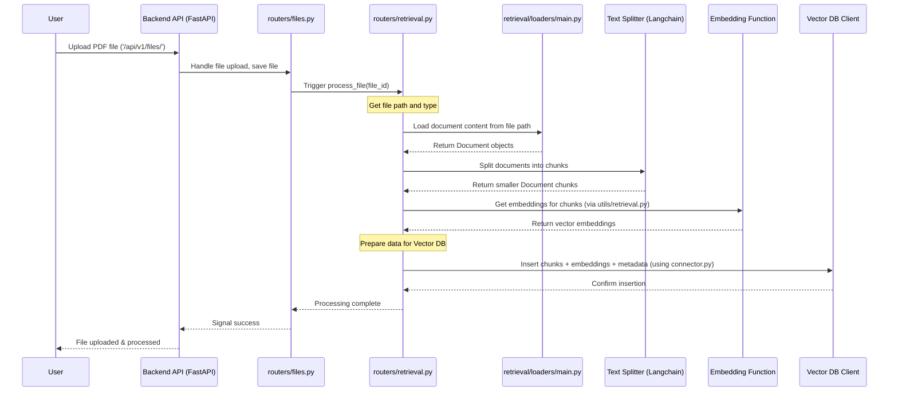
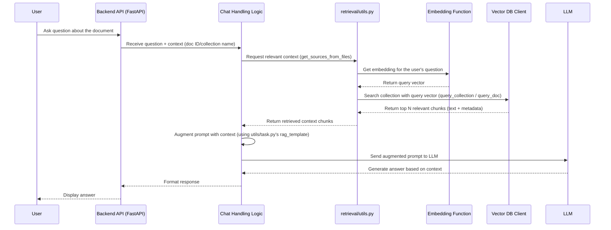

# Chapter 6: Retrieval Augmented Generation (RAG)

Welcome back! In [Chapter 5: User & Access Management](05_user___access_management.md), we saw how Open WebUI identifies users and controls what they can do. But what if you want the AI to answer questions based on *your own documents* or information found on the web? Standard LLMs only know what they were trained on, which might be outdated or not include specific private information.

This is where **Retrieval Augmented Generation (RAG)** comes in. It's like giving the AI **temporary access to a specific library** (your documents or the web) before it answers your question.

## What's the Point? Making the AI Smarter with Your Data

Imagine you upload a PDF manual for a new gadget and ask, "How do I pair the Bluetooth?". Without RAG, the AI might give a generic answer or say it doesn't know. With RAG, Open WebUI can find the exact pairing instructions *from your manual* and use that information to give you a precise answer.

RAG allows the LLM to:

*   **Access Up-to-Date Information:** Get information from the web right now.
*   **Use Private Data:** Answer questions based on documents you provide.
*   **Cite Sources:** Explain *where* it found the information used in its answer.
*   **Reduce Hallucinations:** Base answers on actual retrieved text, making them more factual.

**Use Case:** You upload a PDF research paper about climate change. Later, you ask Open WebUI, "What were the main findings of the climate paper I uploaded?". How does Open WebUI find the relevant parts of the PDF and use them to answer your question?

## The RAG Recipe: From Document to Answer

RAG involves a sequence of steps to make your information usable by the LLM. Think of it like preparing research notes for someone:

1.  **Loading (Reading the Books):**
    *   **What:** Open WebUI reads the content of your documents (like PDFs, text files, Word docs) or web pages, or even gets transcripts from YouTube videos.
    *   **Analogy:** Gathering all the books and articles you need for your research.

2.  **Splitting (Making Flashcards):**
    *   **What:** Long documents are broken down into smaller, manageable chunks or paragraphs.
    *   **Analogy:** Instead of reading whole books at once, you make flashcards with key paragraphs or sections.

3.  **Embedding (Finding the Meaning Coordinates):**
    *   **What:** Each text chunk is converted into a list of numbers called a "vector embedding". These numbers represent the chunk's meaning in a mathematical way. Chunks with similar meanings will have similar numbers.
    *   **Analogy:** Imagine plotting each flashcard on a giant map based on its topic. Cards about "Bluetooth pairing" would cluster together, while cards about "battery life" would be elsewhere.

4.  **Storing (Organizing the Map):**
    *   **What:** These numerical vector embeddings (and the original text chunks) are stored in a special database called a "Vector Database" (like ChromaDB, which is often the default, or others like Milvus, Qdrant).
    *   **Analogy:** Saving your map of flashcard coordinates so you can easily find them later.

5.  **Retrieving (Finding Relevant Flashcards):**
    *   **What:** When you ask a question, your question is also converted into a vector embedding. The system then searches the vector database for the text chunks whose embeddings are mathematically closest to your question's embedding. These are the chunks most likely relevant to your question.
    *   **Analogy:** You plot your question ("How to pair Bluetooth?") on the map. The system finds the flashcards closest to your question's coordinates on the map.

6.  **Augmenting (Adding Notes to the Question):**
    *   **What:** The relevant text chunks found in the previous step are taken and added to your original question as context. This combined text (context + original question) is then sent to the LLM.
    *   **Analogy:** Taking the relevant flashcards and attaching them to your question before giving it to the expert (the LLM) to answer. The expert now has the specific information needed.

## Solving the Use Case: Asking About the Climate Paper

Let's see how RAG answers your question, "What were the main findings of the climate paper I uploaded?":

1.  **Loading:** When you uploaded the PDF, Open WebUI read its content.
2.  **Splitting:** The long paper was split into smaller text chunks.
3.  **Embedding:** Each chunk was converted into a numerical vector embedding.
4.  **Storing:** These embeddings (and the text) were saved in the vector database, linked to the PDF file (or a "Knowledge Base" containing the file). Let's say this is stored under a specific ID, like `collection-climate-paper`.
5.  **(Later) Retrieving:**
    *   You ask your question.
    *   Your question "What were the main findings..." is converted into a query vector embedding.
    *   Open WebUI searches the `collection-climate-paper` in the vector database for chunk embeddings closest to your query embedding. It finds, say, 3 chunks discussing the paper's conclusions.
6.  **Augmenting & Generating:**
    *   The text from those 3 relevant chunks is retrieved.
    *   A prompt is constructed like this (simplified):
        ```
        Context from the document:
        [Text of chunk 1 about findings]
        [Text of chunk 2 about findings]
        [Text of chunk 3 about findings]

        Based only on the context provided, answer the question: What were the main findings of the climate paper I uploaded?
        ```
    *   This augmented prompt is sent to the LLM ([Chapter 3: LLM Integration (Ollama/OpenAI)](03_llm_integration__ollama_openai_.md)).
    *   The LLM reads the context and the question, and generates an answer based *specifically* on the provided findings from the paper.

## Under the Hood: How Open WebUI Implements RAG

Let's trace the data flow when you upload a file and then ask a question about it.

**Upload/Processing Flow:**



**Query/Retrieval Flow:**



**Code Dive:**

1.  **Loading (`retrieval/loaders/main.py`):** The `Loader` class figures out which specific Langchain document loader to use based on the file type or extension.

    ```python
    # File: backend/open_webui/retrieval/loaders/main.py (Simplified _get_loader)
    import logging
    from langchain_community.document_loaders import PyPDFLoader, TextLoader, YoutubeLoader
    # ... other loaders ...

    log = logging.getLogger(__name__)

    class Loader:
        # ... (init method) ...

        def _get_loader(self, filename: str, file_content_type: str, file_path: str):
            file_ext = filename.split(".")[-1].lower()

            # Example logic for choosing a loader
            if file_ext == "pdf":
                log.info("Using PyPDFLoader for PDF file.")
                loader = PyPDFLoader(file_path, extract_images=self.kwargs.get("PDF_EXTRACT_IMAGES"))
            elif self._is_text_file(file_ext, file_content_type): # Checks for .txt, .py, .js etc.
                log.info("Using TextLoader for text file.")
                loader = TextLoader(file_path, autodetect_encoding=True)
            # ... (add checks for .docx, .csv, web URLs, YouTube etc.) ...
            elif "youtube.com" in filename or "youtu.be" in filename:
                 log.info("Using YoutubeLoader for YouTube URL.")
                 # filename is the URL here
                 loader = YoutubeLoader(video_id=filename, language=["en"])
            else:
                log.warning(f"No specific loader found for {filename}, using default TextLoader.")
                loader = TextLoader(file_path, autodetect_encoding=True)

            return loader

        def load(self, filename: str, file_content_type: str, file_path: str) -> list[Document]:
            loader = self._get_loader(filename, file_content_type, file_path)
            docs = loader.load()
            # ... (text fixing) ...
            return docs

    ```
    **Explanation:** Based on the file extension (like `.pdf`) or content type, this code selects the appropriate tool (like `PyPDFLoader`) to read the document's content.

2.  **Splitting (`routers/retrieval.py` using Langchain):** The `save_docs_to_vector_db` function uses a text splitter.

    ```python
    # File: backend/open_webui/routers/retrieval.py (Simplified snippet in save_docs_to_vector_db)
    from langchain.text_splitter import RecursiveCharacterTextSplitter, TokenTextSplitter
    import tiktoken # For token splitting

    def save_docs_to_vector_db(...):
        # ... (other code) ...
        if split:
            if request.app.state.config.TEXT_SPLITTER == "token":
                 # Use splitter based on token count
                 text_splitter = TokenTextSplitter(
                     encoding_name=str(request.app.state.config.TIKTOKEN_ENCODING_NAME),
                     chunk_size=request.app.state.config.CHUNK_SIZE,
                     chunk_overlap=request.app.state.config.CHUNK_OVERLAP,
                 )
            else: # Default is "character"
                 # Use splitter based on character count
                 text_splitter = RecursiveCharacterTextSplitter(
                     chunk_size=request.app.state.config.CHUNK_SIZE,
                     chunk_overlap=request.app.state.config.CHUNK_OVERLAP,
                 )

            # Break documents into smaller pieces
            docs = text_splitter.split_documents(docs)

        # ... (rest of the function: embedding, storing) ...
    ```
    **Explanation:** This part uses tools like `RecursiveCharacterTextSplitter` or `TokenTextSplitter` to divide the loaded documents (`docs`) into smaller chunks based on configured size and overlap.

3.  **Embedding (`retrieval/utils.py`):** The `get_embedding_function` helps get the right function, and then it's used to convert text to vectors.

    ```python
    # File: backend/open_webui/retrieval/utils.py (Simplified usage in routers/retrieval.py)

    # In routers/retrieval.py -> save_docs_to_vector_db
    # ...
    embedding_function = get_embedding_function(
        request.app.state.config.RAG_EMBEDDING_ENGINE, # e.g., "", "ollama", "openai"
        request.app.state.config.RAG_EMBEDDING_MODEL,  # e.g., "sentence-transformers/all-MiniLM-L6-v2"
        request.app.state.ef, # The actual loaded model object if engine is ""
        # ... URLs and Keys for Ollama/OpenAI ...
        request.app.state.config.RAG_EMBEDDING_BATCH_SIZE,
    )

    texts = [doc.page_content for doc in docs] # Get text from chunks
    # Convert text chunks to vector embeddings
    embeddings = embedding_function(
        texts,
        prefix=RAG_EMBEDDING_CONTENT_PREFIX, # Optional prefix for content embeddings
        user=user, # Pass user info if needed by embedding service
    )
    # ...
    ```
    **Explanation:** An `embedding_function` (configured based on settings like using a local Sentence Transformer or an external API like Ollama/OpenAI) is called to turn the text content of each chunk into a list of numbers (vector embedding).

4.  **Storing (`retrieval/vector/connector.py` and `dbs/chroma.py`):** The `VECTOR_DB_CLIENT` is used to save the data.

    ```python
    # File: backend/open_webui/retrieval/vector/connector.py (Concept)
    from open_webui.config import VECTOR_DB
    # Import the specific client based on config (e.g., ChromaClient)
    if VECTOR_DB == "chroma":
        from open_webui.retrieval.vector.dbs.chroma import ChromaClient
        VECTOR_DB_CLIENT = ChromaClient()
    # ... elif for milvus, qdrant etc. ...

    # File: backend/open_webui/retrieval/vector/dbs/chroma.py (Simplified insert)
    import chromadb
    from chromadb.utils.batch_utils import create_batches

    class ChromaClient:
        def __init__(self):
            # ... (connect to ChromaDB) ...
            self.client = chromadb.PersistentClient(...)

        def insert(self, collection_name: str, items: list[VectorItem]):
            # Get or create the collection (like a table)
            collection = self.client.get_or_create_collection(name=collection_name, ...)

            ids = [item["id"] for item in items]
            documents = [item["text"] for item in items]
            embeddings = [item["vector"] for item in items]
            metadatas = [item["metadata"] for item in items]

            # Add the data in batches
            for batch in create_batches(api=self.client, ids=ids, embeddings=embeddings, documents=documents, metadatas=metadatas):
                collection.add(*batch)

    # Usage in routers/retrieval.py -> save_docs_to_vector_db
    # ... (prepare items list with id, text, vector, metadata) ...
    VECTOR_DB_CLIENT.insert(collection_name=collection_name, items=items)
    # ...
    ```
    **Explanation:** The code uses a client (`VECTOR_DB_CLIENT`, which could be Chroma, Milvus, etc.) to `insert` the prepared `items` (containing unique IDs, the original text chunk, the vector embedding, and metadata like the source filename) into the specified `collection_name`.

5.  **Retrieving (`retrieval/utils.py`):** Functions like `query_collection` or `query_doc` search the vector database.

    ```python
    # File: backend/open_webui/retrieval/utils.py (Simplified query_doc)
    from open_webui.retrieval.vector.connector import VECTOR_DB_CLIENT

    def query_doc(
        collection_name: str, query_embedding: list[float], k: int, user=None
    ):
        try:
            log.debug(f"Querying collection '{collection_name}'")
            # Use the Vector DB client to search
            result = VECTOR_DB_CLIENT.search(
                collection_name=collection_name,
                vectors=[query_embedding], # The embedding of the user's question
                limit=k, # Number of results to retrieve
            )
            # result contains ids, distances, documents, metadatas
            return result
        except Exception as e:
            log.exception(f"Error querying collection {collection_name}: {e}")
            raise e

    # Usage might be inside get_sources_from_files called by chat logic
    # ...
    # query_embedding = embedding_function(user_question, prefix=RAG_EMBEDDING_QUERY_PREFIX, user=user)
    # context = query_doc(collection_name="collection-climate-paper", query_embedding=query_embedding, k=3)
    # ...
    ```
    **Explanation:** The user's question is turned into a `query_embedding`. This embedding is used to `search` the relevant `collection_name` in the vector database for the `k` most similar document chunks. The database returns the matching chunks, their similarity scores (distances), and metadata.

6.  **Augmenting (`utils/task.py`):** The retrieved text is formatted and added to the prompt.

    ```python
    # File: backend/open_webui/utils/task.py (Simplified rag_template)
    from open_webui.config import DEFAULT_RAG_TEMPLATE

    def rag_template(template: str, context: str, query: str):
        if not template.strip():
            template = DEFAULT_RAG_TEMPLATE # Use default if none provided

        # Replace placeholders in the template
        # Ensure context/query from the context don't conflict with template placeholders
        safe_template = template.replace("[context]", "{{CONTEXT_PLACEHOLDER}}")
        safe_template = safe_template.replace("[query]", "{{QUERY_PLACEHOLDER}}")
        safe_template = safe_template.replace("{{CONTEXT}}", "{{CONTEXT_PLACEHOLDER}}")
        safe_template = safe_template.replace("{{QUERY}}", "{{QUERY_PLACEHOLDER}}")

        # Now insert the actual context and query
        final_prompt = safe_template.replace("{{CONTEXT_PLACEHOLDER}}", context)
        final_prompt = final_prompt.replace("{{QUERY_PLACEHOLDER}}", query)

        return final_prompt

    # Usage in chat logic (conceptual)
    # ...
    # retrieved_chunks = [doc['text'] for doc in relevant_context_results]
    # context_string = "\n\n".join(retrieved_chunks)
    # final_llm_prompt = rag_template(template=config.RAG_TEMPLATE, context=context_string, query=user_question)
    # response = send_to_llm(final_llm_prompt)
    # ...
    ```
    **Explanation:** The `rag_template` function takes a base prompt template (which usually includes placeholders like `{{CONTEXT}}` and `{{QUERY}}`), the retrieved text chunks (`context`), and the user's original question (`query`). It inserts the context and query into the template to create the final prompt that will be sent to the LLM.

## Conclusion

Retrieval Augmented Generation (RAG) is a powerful technique that lets Open WebUI leverage external knowledge – your documents or the web – to provide more accurate, relevant, and up-to-date answers. By loading, splitting, embedding, storing, retrieving, and augmenting, RAG effectively gives the LLM targeted information just when it needs it.

This process happens behind the scenes when you use features like uploading documents or enabling web search in Open WebUI.

Now that we've seen how Open WebUI can generate responses, how does it handle the smooth, real-time display of text as the AI "types" its answer? In the next chapter, we'll explore [Chapter 7: Real-time Communication (WebSockets)](07_real_time_communication__websockets_.md).

---

Generated by [AI Codebase Knowledge Builder](https://github.com/The-Pocket/Tutorial-Codebase-Knowledge)