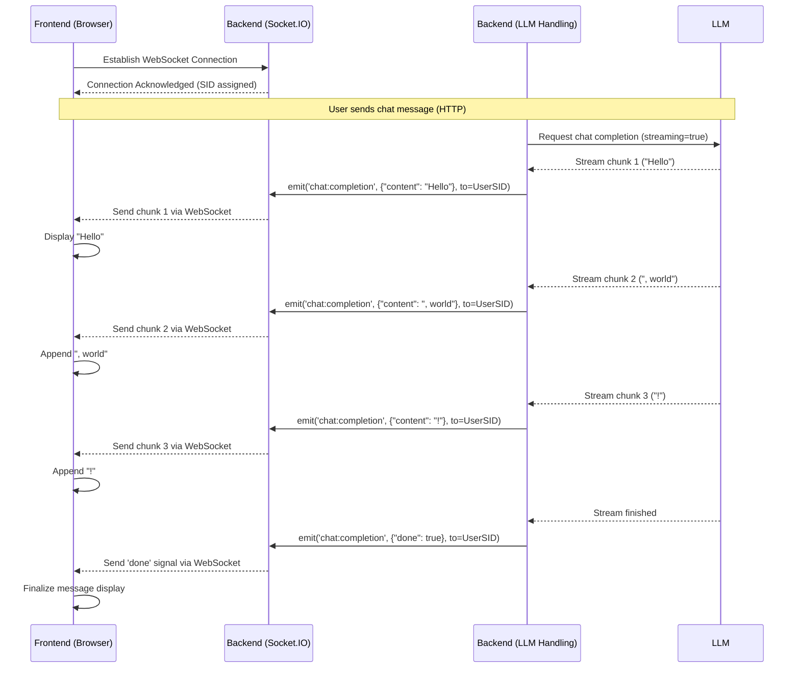

# Chapter 7: Real-time Communication (WebSockets)

Welcome back! In [Chapter 6: Retrieval Augmented Generation (RAG)](06_retrieval_augmented_generation__rag_.md), we learned how Open WebUI can fetch information from your documents or the web to provide richer answers. But have you noticed how the AI's response appears smoothly on the screen, word by word, instead of all at once after a long pause? Or how typing indicators might appear when someone else is using a shared chat?

This magic happens thanks to **Real-time Communication**, primarily using a technology called **WebSockets**. Think of it as Open WebUI's **live notification system**.

## Why Do We Need a Live Notification System?

Imagine using a regular website. You click a button, the page reloads, and you see the new content. This is like sending a letter: you ask for something, wait, and get a response back. This is called the **HTTP request-response cycle**. It works fine for many things, but it's not great for instant updates.

What if you want:

*   To see the AI's response as it's being generated (streaming)?
*   To get a notification *immediately* when a background task (like processing a document for RAG) is finished?
*   To see if other users are typing in a shared channel?
*   To see live updates to system stats (like how many people are using a model)?

Waiting to refresh the page or constantly asking the server "Anything new yet?" is inefficient. We need a way for the backend server to *push* information to the frontend (your browser) instantly when something happens.

**Use Case:** Let's focus on the most common example: you ask the AI a question, and you want to see the answer appear word-by-word in the chat window, just like the AI is typing it live. How does the backend send these little pieces of the answer to your browser without you needing to refresh?

## The Key Concepts: Phone Lines and Code Words

1.  **WebSockets (The Open Phone Line):**
    *   **Analogy:** Instead of sending letters back and forth (HTTP), imagine opening a direct, persistent phone line between your browser (frontend) and the Open WebUI server (backend).
    *   **What it is:** WebSockets create a two-way communication channel that stays open. Once established, both the frontend and the backend can send messages to each other instantly without needing to initiate a new request each time.

2.  **Socket.IO (The Reliable Phone Company):**
    *   **Analogy:** Setting up and managing raw phone lines (WebSockets) can be tricky. What if the connection drops? Socket.IO is like a specialized phone company that handles establishing the WebSocket connection reliably, automatically trying to reconnect if it drops, and even falling back to older methods (like polling) if WebSockets aren't supported. It makes using real-time communication much easier for developers.
    *   **What it is:** Open WebUI uses the Socket.IO library on both the frontend and backend to manage these real-time connections.

3.  **Events (Code Words on the Line):**
    *   **Analogy:** On your open phone line, you need specific "code words" to indicate what you're talking about. You might say "Status Update:" or "New Message:".
    *   **What it is:** When the backend sends data over the WebSocket using Socket.IO, it sends it as an **event** with a name and some associated data (usually in JSON format).
    *   **Examples:**
        *   `chat:completion`: Backend sends a chunk of the AI's response. Data might be `{"content": "Hello"}`.
        *   `status`: Backend sends an update about a background task. Data might be `{"action": "rag_processing", "status": "complete"}`.
        *   `typing`: Backend (or another user via backend) signals typing. Data might be `{"user": "Alice", "is_typing": true}`.
        *   `usage`: Backend sends updated model usage stats.
    *   The frontend listens for these specific event names and reacts accordingly (e.g., updates the chat, shows a notification).

4.  **Rooms/Channels (Conference Calls / Specific Lines):**
    *   **Analogy:** Instead of just one-to-one calls, you might want conference calls or dedicated lines for specific topics.
    *   **What it is:** Socket.IO allows grouping connections into "rooms" or "channels". This is useful for sending messages only to users interested in a specific chat or channel. For example, updates for a specific chat (`chat_id: xyz`) might be sent only to the WebSocket connections that have "joined" the room `chat:xyz`. Open WebUI uses this for features like shared channels ([See Chapter 5: User & Access Management](05_user___access_management.md) concepts).

5.  **(Advanced) Redis (The Central Switchboard):**
    *   **Analogy:** If the phone company (Open WebUI) gets really big and has multiple operators (backend instances), how does an incoming call (user connection) get routed correctly, and how can Operator A send a message to a user connected to Operator B? Redis acts like a central switchboard connecting all the operators.
    *   **What it is:** When running Open WebUI with multiple backend processes (for handling more users), a single process doesn't know about users connected to other processes. Redis can be used as a "message broker" for Socket.IO. When one backend instance wants to send a message to a specific user or room, it publishes the message to Redis, and Redis ensures it gets delivered to the correct backend instance(s) that have the relevant user(s) connected. This is configured via `WEBSOCKET_MANAGER="redis"` in `env.py`.

## Solving the Use Case: Streaming AI Responses

Let's trace how you see the AI's response appear word-by-word:

1.  **Connection:** When you load Open WebUI, the frontend establishes a Socket.IO (WebSocket) connection with the backend. The backend keeps track of this connection using a unique Session ID (SID).
2.  **Request:** You send your message to the AI via a regular HTTP request ([Chapter 4: Backend API & Routing (FastAPI)](04_backend_api___routing__fastapi_.md)).
3.  **LLM Processing:** The backend sends the request to the LLM ([Chapter 3: LLM Integration (Ollama/OpenAI)](03_llm_integration__ollama_openai_.md)), configured to *stream* the response back.
4.  **Receiving Chunks:** The backend starts receiving small chunks of the AI's response (e.g., "Hello", then ", how", then " can I", then " help?").
5.  **Emitting Events:** For *each chunk* it receives, the backend uses Socket.IO to **emit** a `chat:completion` event over the WebSocket connection specifically to *your* browser session. The data sent with the event contains the text chunk (e.g., `{"content": ", how"}`).
6.  **Frontend Listening:** The frontend code in your browser is constantly listening for `chat:completion` events on its Socket.IO connection.
7.  **Updating UI:** When the frontend receives a `chat:completion` event, it takes the text chunk from the event data and appends it to the chat message being displayed on your screen.

This emit-listen-update loop happens very quickly for each chunk, creating the illusion that the AI is typing live.

## Under the Hood: Making the Live Connection

Let's see how the backend sets up and uses Socket.IO.

**Sequence Diagram (Simplified Streaming):**



**Code Dive:**

1.  **Setting up Socket.IO (`env.py`, `socket/main.py`):**
    Environment variables control if WebSockets are enabled and if Redis is used.

    ```python
    # File: backend/open_webui/env.py (Simplified Snippet)
    import os

    # Enable/Disable WebSocket support entirely
    ENABLE_WEBSOCKET_SUPPORT = (
        os.environ.get("ENABLE_WEBSOCKET_SUPPORT", "True").lower() == "true"
    )

    # Choose the manager: "" (default, in-memory) or "redis"
    WEBSOCKET_MANAGER = os.environ.get("WEBSOCKET_MANAGER", "")

    # Redis URL if WEBSOCKET_MANAGER is "redis"
    REDIS_URL = os.environ.get("REDIS_URL", "")
    # Optional Redis Sentinel configuration
    WEBSOCKET_REDIS_URL = os.environ.get("WEBSOCKET_REDIS_URL", REDIS_URL)
    # ... other Redis/Sentinel settings ...
    ```
    **Explanation:** These environment variables allow configuring the real-time system, like turning it off or telling it to use Redis for multi-instance coordination.

    The core Socket.IO server is created, potentially with the Redis manager.

    ```python
    # File: backend/open_webui/socket/main.py (Simplified Setup)
    import socketio
    from open_webui.env import (
        ENABLE_WEBSOCKET_SUPPORT, WEBSOCKET_MANAGER, WEBSOCKET_REDIS_URL, # ... other redis vars
    )
    from open_webui.utils.redis import get_sentinel_url_from_env # Helper

    # Conditionally create the Socket.IO server
    if WEBSOCKET_MANAGER == "redis":
        # If using Redis, configure the Redis Manager
        # (Handles Sentinel logic using get_sentinel_url_from_env)
        mgr = socketio.AsyncRedisManager(
            get_sentinel_url_from_env(...) if WEBSOCKET_SENTINEL_HOSTS else WEBSOCKET_REDIS_URL
        )
        print("Using Redis for WebSocket management.")
    else:
        # Default: Use the standard in-memory manager
        mgr = None
        print("Using in-memory WebSocket management.")

    # Create the main Socket.IO Async Server instance
    sio = socketio.AsyncServer(
        cors_allowed_origins=[], # Configure allowed origins
        async_mode="asgi",      # Use with FastAPI
        client_manager=mgr,     # Use Redis manager if configured
        # Only allow WebSocket transport if enabled
        transports=(["websocket"] if ENABLE_WEBSOCKET_SUPPORT else ["polling"]),
        allow_upgrades=ENABLE_WEBSOCKET_SUPPORT,
        always_connect=True, # Useful for some auth flows
    )

    # Create the ASGI app to be mounted in FastAPI
    app = socketio.ASGIApp(
        sio,
        socketio_path="/ws/socket.io", # Standard Socket.IO path
    )
    ```
    **Explanation:** This code initializes the Socket.IO server (`sio`). It checks the `WEBSOCKET_MANAGER` config: if set to `"redis"`, it configures `socketio.AsyncRedisManager` to use Redis (handling normal and Sentinel connections); otherwise, it uses the default manager suitable for single-instance setups. The `app` created here is later mounted into the main FastAPI application.

2.  **Handling Connections and Authentication (`socket/main.py`):**
    When a browser connects, the backend authenticates the user and stores their session.

    ```python
    # File: backend/open_webui/socket/main.py (Simplified Connection)
    from open_webui.utils.auth import decode_token
    from open_webui.models.users import Users

    # Store session info (In-memory example, RedisDict used if WEBSOCKET_MANAGER="redis")
    SESSION_POOL = {} # Maps SID to user info
    USER_POOL = {}    # Maps user ID to list of SIDs

    @sio.event
    async def connect(sid, environ, auth):
        user = None
        if auth and "token" in auth:
            # Decode the JWT token sent by the client
            data = decode_token(auth["token"])
            if data and "id" in data:
                # Find the user in the database
                user = Users.get_user_by_id(data["id"])

        if user:
            print(f"User {user.name} connected with SID {sid}")
            # Store user info associated with this specific connection (SID)
            SESSION_POOL[sid] = user.model_dump()
            # Add this SID to the list of connections for this user ID
            if user.id not in USER_POOL: USER_POOL[user.id] = []
            USER_POOL[user.id].append(sid)

            # Example: Join a room for a specific channel if needed
            # await sio.enter_room(sid, f"channel:{some_channel_id}")
        else:
            print(f"Anonymous or invalid connection attempt with SID {sid}")
            # Optionally disconnect if authentication fails
            # return False

    @sio.event
    async def disconnect(sid):
        if sid in SESSION_POOL:
            user = SESSION_POOL[sid]
            user_id = user["id"]
            print(f"User {user['name']} disconnected (SID: {sid})")

            # Clean up pools
            del SESSION_POOL[sid]
            if user_id in USER_POOL:
                USER_POOL[user_id].remove(sid)
                if not USER_POOL[user_id]: # Remove user ID if no sessions left
                    del USER_POOL[user_id]
        else:
            print(f"Unknown SID {sid} disconnected")

    ```
    **Explanation:**
    *   The `@sio.event` decorator registers functions to handle specific Socket.IO events like `connect` and `disconnect`.
    *   When a user connects, the `connect` function receives the authentication token (`auth`). It decodes the token ([Chapter 5: User & Access Management](05_user___access_management.md)) to identify the user.
    *   If authenticated, it stores the user's info mapped to their unique connection ID (`sid`) in `SESSION_POOL` and adds the `sid` to the `USER_POOL` under the user's ID. (If using Redis, `SESSION_POOL` and `USER_POOL` would be instances of `RedisDict` for shared state).
    *   The `disconnect` function cleans up these mappings when a user disconnects.

3.  **Emitting Events (e.g., Chat Chunks in `utils/middleware.py`):**
    The backend logic (often after getting data from the LLM or database) uses `sio.emit` to send data.

    ```python
    # File: backend/open_webui/socket/main.py (Simplified Emitter Helper)

    # Helper function often used by other parts of the backend
    def get_event_emitter(request_info):
        user_id = request_info["user_id"]
        chat_id = request_info.get("chat_id", None)
        message_id = request_info.get("message_id", None)
        session_id_from_request = request_info.get("session_id", None)

        async def __event_emitter__(event_data):
            # Find all active connection SIDs for this user
            target_sids = USER_POOL.get(user_id, [])
            if session_id_from_request and session_id_from_request not in target_sids:
                 target_sids.append(session_id_from_request) # Ensure the requesting session gets it

            # Emit the event to all relevant sessions for this user
            for sid in target_sids:
                await sio.emit(
                    "chat-events", # The "code word" the frontend listens for
                    {
                        "chat_id": chat_id,
                        "message_id": message_id,
                        "data": event_data, # The actual payload (e.g., {"content": "chunk"})
                    },
                    to=sid, # Send specifically to this connection ID
                )
            # ... (Optional: Update database state based on emitted event) ...
        return __event_emitter__

    # --- Usage Example (Conceptual, often in utils/middleware.py or chat logic) ---
    # async def handle_llm_stream(request_info, llm_stream):
    #    event_emitter = get_event_emitter(request_info)
    #    async for chunk in llm_stream:
    #        # Got a chunk from the LLM
    #        await event_emitter({
    #            "type": "chat:completion", # Sub-type within chat-events
    #            "data": {"content": chunk}
    #        })
    #    # Signal completion
    #    await event_emitter({"type": "chat:completion", "data": {"done": True}})
    ```
    **Explanation:**
    *   The `get_event_emitter` function is a helper that creates an `__event_emitter__` function tailored to a specific request (knowing the user ID, chat ID, etc.).
    *   The `__event_emitter__` function takes the data payload (`event_data`).
    *   It finds all the active connection SIDs for the target `user_id` from the `USER_POOL`.
    *   It then loops through these SIDs and calls `sio.emit()`.
    *   `sio.emit("chat-events", ..., to=sid)` sends the event named `chat-events` with the provided data, but *only* to the specific connection identified by `sid`. This ensures the message chunk goes only to the correct user's browser session(s).

4.  **Frontend Listening (Conceptual):**
    The frontend JavaScript/TypeScript code would use the Socket.IO client library:

    ```javascript
    // File: frontend/... (Conceptual Example)
    import { io } from "socket.io-client";

    // Connect to the backend Socket.IO server
    const socket = io({ auth: { token: /* user's JWT token */ } });

    socket.on("connect", () => {
      console.log("Connected to backend via WebSocket!");
    });

    // Listen for the 'chat-events' event from the backend
    socket.on("chat-events", (event) => {
      console.log("Received chat event:", event);

      const eventType = event.data?.type;
      const eventPayload = event.data?.data;

      if (eventType === "chat:completion" && eventPayload) {
        if (eventPayload.done) {
          console.log("AI finished streaming.");
          // Finalize message display
        } else if (eventPayload.content) {
          // Append the received text chunk to the chat message UI
          const messageElement = document.getElementById(`message-${event.message_id}`);
          if (messageElement) {
            messageElement.textContent += eventPayload.content;
          }
        }
      }
      // Handle other event types like 'status', 'typing', etc.
    });

    socket.on("disconnect", () => {
      console.log("Disconnected from backend.");
    });
    ```
    **Explanation:** This conceptual frontend code connects to the Socket.IO server, sending the auth token. It then sets up a listener using `socket.on("chat-events", ...)` function. When the backend emits a `chat-events` event, this function runs, checks the `type` within the data (e.g., `chat:completion`), and updates the user interface accordingly by appending the `content` to the appropriate message element.

## Conclusion

Real-time communication via WebSockets, managed by Socket.IO, is what makes Open WebUI feel responsive and alive. It replaces the slow letter-sending (HTTP) with an open phone line, allowing the backend to instantly push updates like AI response chunks, status changes, or notifications to your browser. This creates a much smoother and more interactive user experience. Using Redis allows this real-time system to scale effectively across multiple backend instances.

Now that we've covered the core components from configuration to real-time updates, how can we make Open WebUI even more powerful by allowing it to use external tools or define custom processing steps?

In the next chapter, we'll explore [Chapter 8: Extensibility (Functions/Tools/Pipelines)](08_extensibility__functions_tools_pipelines_.md).

---

Generated by [AI Codebase Knowledge Builder](https://github.com/The-Pocket/Tutorial-Codebase-Knowledge)