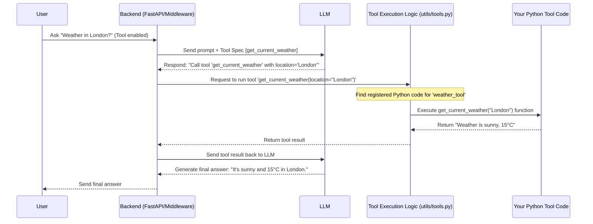
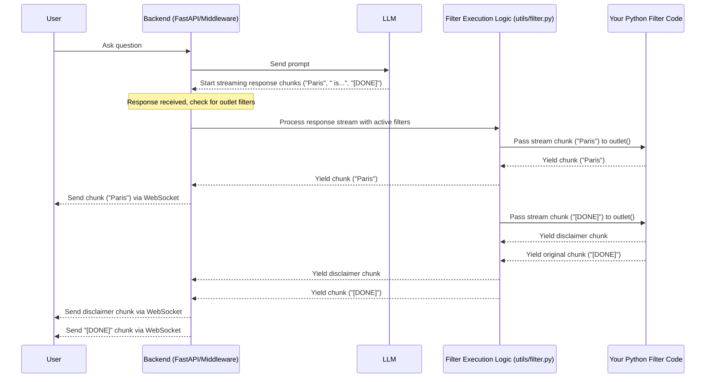

# Chapter 8: Extensibility (Functions/Tools/Pipelines)

Welcome to the final chapter! In [Chapter 7: Real-time Communication (WebSockets)](07_real_time_communication__websockets_.md), we saw how Open WebUI delivers smooth, real-time updates like streaming AI responses. But what if you want to add entirely new capabilities to Open WebUI, going beyond simple chat?

This chapter introduces **Extensibility**. Think of it like **adding apps or plugins to your phone**, but for Open WebUI. This system allows you to inject custom Python code to give the AI new skills or modify how Open WebUI processes chats.

## Why Add More Capabilities? (Motivation)

The core AI models are powerful, but they have limitations. They might not know the current weather, they can't directly access your company's internal database, and sometimes you might want to enforce specific rules on their responses.

Extensibility lets you:

*   **Give the AI new skills:** Allow the AI to use external tools (like fetching weather, searching a specific database, or controlling smart devices).
*   **Modify chat behavior:** Automatically filter responses, add disclaimers, or trigger actions based on what's said.
*   **Integrate with other systems:** Connect Open WebUI to your existing workflows or services.

**Use Case 1 (Tools):** You want to ask the AI, "What's the weather like in London?". The base AI model doesn't have real-time weather data. How can we give it the ability to fetch and use this information?

**Use Case 2 (Pipelines/Filters):** For compliance reasons, you want to automatically add a disclaimer like "AI-generated content may be inaccurate." to the end of *every* response from a specific AI model. How can we intercept and modify the AI's response before it's shown to the user?

## The Building Blocks: Tools, Functions, and Pipelines

Open WebUI provides a few ways to extend its functionality using Python code:

1.  **Tools (Giving the AI New Abilities):**
    *   **Analogy:** Giving your AI assistant a calculator app, a web search app, or a connection to a weather service.
    *   **What they are:** Tools define specific actions (written as Python functions) that the Large Language Model (LLM) can choose to invoke to get information or perform a task. The LLM decides *when* and *how* to use these tools based on your request.
    *   **How they work:**
        *   You define the tool in Python code (e.g., a function `get_weather(location: str)`).
        *   You tell Open WebUI about this tool, including its name, description, and parameters (using standard formats like OpenAPI function specs).
        *   When you ask a question like "What's the weather in London?", the LLM integration layer ([Chapter 3: LLM Integration (Ollama/OpenAI)](03_llm_integration__ollama_openai_.md)) can tell the LLM that a `get_weather` tool is available.
        *   If the LLM decides to use it, Open WebUI runs your Python function (`get_weather("London")`) and sends the result back to the LLM.
        *   The LLM then uses this weather information to formulate its final answer.
    *   **Types:** Tools can be local Python code running within Open WebUI or connect to external "Tool Servers" defined via OpenAPI specifications.

2.  **Functions (Pipelines: Filters & Actions):**
    *   **Analogy:** Setting up automated rules for your email inbox (like filtering spam or automatically replying) or reacting to events on your smart home system.
    *   **What they are:** These allow you to intercept and modify data as it flows through the system or react to specific events. They are often combined into **Pipelines**.
        *   **Filters:** These functions run *before* a request goes to the LLM (inlet filters) or *after* the LLM response comes back but *before* it's sent to the user (outlet filters). They can modify the request/response data.
        *   **Actions:** These functions are triggered by specific chat events (though less commonly used than filters for modifying content).
    *   **Pipelines:** A sequence of Filters and/or Actions applied to a chat process, allowing for more complex custom workflows.

3.  **Dynamic Loading:**
    *   **Analogy:** Your phone installing and running a new app you just downloaded.
    *   **How it works:** Open WebUI doesn't need to have all custom code built-in. It can dynamically load your Python code for Tools and Functions/Pipelines when needed, making the system very flexible. You typically manage this custom code via the Open WebUI Admin interface.

## Solving Use Case 1: The Weather Tool

Let's enable our AI to fetch the weather.

1.  **Define the Tool:** You (or an admin) would create a Python file defining the weather fetching logic and register it as a "Tool" in Open WebUI's Admin settings.

    ```python
    # File: (Conceptual) backend/open_webui/webui_tools/weather_tool.py
    import requests

    # Define metadata for the tool (in Python or via Admin UI)
    # (This helps the LLM understand what the tool does)
    SPEC = {
        "name": "get_current_weather",
        "description": "Get the current weather for a specific location",
        "parameters": {
            "type": "object",
            "properties": {
                "location": {
                    "type": "string",
                    "description": "The city name (e.g., London, Tokyo)",
                }
            },
            "required": ["location"],
        },
    }

    # The actual function the LLM can call
    def get_current_weather(location: str) -> str:
        """Get the current weather for a specific location."""
        # In a real tool, you'd call a weather API here
        # For simplicity, we'll return a fake result
        if "london" in location.lower():
            return f"The weather in {location} is currently sunny with a temperature of 15°C."
        else:
            return f"Sorry, I don't have weather information for {location}."

    # The Tool needs to expose its spec and functions
    # (Simplified - actual implementation uses classes/decorators)
    class Tools:
        specs = [SPEC]
        def get_current_weather(self, location: str) -> str:
            return get_current_weather(location)
    ```
    **Explanation:** We define the `get_current_weather` function and its `SPEC`. The spec tells the LLM the tool's name (`get_current_weather`), what it does, and what input it needs (`location`).

2.  **User Asks:** You select a model in Open WebUI and ask, "What's the weather like in London?". You also need to enable the `weather_tool` for this chat session (usually via a UI toggle).
3.  **LLM Interaction:**
    *   The backend sends your request *and* the spec for the `get_current_weather` tool to the LLM.
    *   The LLM recognizes that it needs weather data and decides to call the tool. It responds indicating it wants to call `get_current_weather` with `location="London"`.
4.  **Tool Execution:**
    *   Open WebUI receives the LLM's request to call the tool.
    *   It finds the registered `weather_tool` and executes the `get_current_weather("London")` Python function.
    *   The function returns: "The weather in London is currently sunny with a temperature of 15°C."
5.  **Final Response:**
    *   Open WebUI sends the tool's result back to the LLM.
    *   The LLM uses this information to generate the final user-facing answer: "The current weather in London is sunny and 15°C."

## Solving Use Case 2: The Disclaimer Filter (Pipeline)

Let's automatically add a disclaimer to AI responses.

1.  **Define the Filter:** An admin creates a Python file defining an "outlet" filter and registers it as a "Function" (type: filter) in Open WebUI.

    ```python
    # File: (Conceptual) backend/open_webui/webui_functions/disclaimer_filter.py

    # Define metadata (optional, can configure priority, etc.)
    """
    priority: 100
    """

    # The filter function that modifies the response stream
    async def outlet(body: dict, __user__: dict):
        """Appends a disclaimer to the end of the response stream."""

        disclaimer = "\n\n*Disclaimer: AI-generated content may be inaccurate.*"
        final_chunk_processed = False

        # Process streaming chunks
        async for chunk in body: # 'body' here is the stream from the LLM
            # Check if this is the final chunk signal ([DONE])
            if isinstance(chunk, str) and chunk.strip() == "data: [DONE]":
                 final_chunk_processed = True
                 # Add disclaimer *before* the [DONE] signal
                 yield f"data: {{'choices': [{{'delta': {{'content': '{disclaimer}'}}}}]}}\n\n"
                 yield chunk # Send the original [DONE] signal
                 break
            else:
                 yield chunk # Pass through other chunks unchanged

        # If stream ended without a [DONE] signal (non-streaming or error)
        # (Simplified handling)
        if not final_chunk_processed:
            # If body is a dict (non-streaming), append disclaimer to content
            if isinstance(body, dict) and body.get("choices"):
                 body["choices"][0]["message"]["content"] += disclaimer
                 yield body
            # Otherwise, just yield the original body (might be an error)
            else:
                 yield body

    # The Filter needs to expose its functions
    # (Simplified - actual implementation uses classes)
    class Filter:
        async def outlet(self, body: dict, __user__: dict):
             async for item in outlet(body, __user__):
                 yield item
    ```
    **Explanation:** This defines an `outlet` function. It receives the response `body` (which could be a stream of chunks or a single dictionary). It yields each chunk as it comes, but right before the final `[DONE]` signal (for streaming responses), it injects an extra chunk containing the disclaimer text.

2.  **User Asks:** You chat with an AI model.
3.  **LLM Responds:** The LLM generates its response (e.g., "Paris is the capital of France.").
4.  **Filter Intercepts:** Before the response is sent back to your browser via the WebSocket ([Chapter 7: Real-time Communication (WebSockets)](07_real_time_communication__websockets_.md)), Open WebUI checks for active "outlet" filters. It finds the `disclaimer_filter`.
5.  **Filter Modifies:** The `outlet` function runs. It lets the original response chunks ("Paris", " is the capital", " of France.") pass through. Just before the final `[DONE]` signal, it inserts the disclaimer chunk.
6.  **Final Output to User:** Your browser receives the stream: "Paris is the capital of France.\n\n*Disclaimer: AI-generated content may be inaccurate.*"

## Under the Hood: How Open WebUI Runs Your Code

Let's look at the flow for both scenarios.

**Tool Execution Sequence:**



**Pipeline (Outlet Filter) Execution Sequence:**



## Code Dive: A Glimpse Inside

Let's peek at simplified versions of how Open WebUI handles this.

1.  **Loading Plugins (`utils/plugin.py`):** This utility dynamically loads Python code from the database or content string.

    ```python
    # File: backend/open_webui/utils/plugin.py (Simplified load_function_module_by_id)
    import sys
    import types
    import os
    import tempfile
    from open_webui.models.functions import Functions # DB model for Functions

    def load_function_module_by_id(function_id, content=None):
        if content is None:
            function = Functions.get_function_by_id(function_id)
            if not function: raise Exception(f"Function not found: {function_id}")
            content = function.content
            # ... (handle import replacements, requirements install) ...

        module_name = f"function_{function_id}" # Unique name for the module
        module = types.ModuleType(module_name) # Create an empty module object
        sys.modules[module_name] = module # Register it

        # Use a temporary file to make `__file__` work inside the code
        temp_file = tempfile.NamedTemporaryFile(delete=False)
        try:
            with open(temp_file.name, "w", encoding="utf-8") as f:
                f.write(content)
            module.__dict__["__file__"] = temp_file.name

            # *** Execute the Python code string within the module's namespace ***
            exec(content, module.__dict__)

            # Determine type based on class defined in the code
            if hasattr(module, "Pipe"): return module.Pipe(), "pipe", {}
            if hasattr(module, "Filter"): return module.Filter(), "filter", {}
            # ... (Action, etc.) ...
            raise Exception("No valid Function class found in module")
        finally:
            os.unlink(temp_file.name) # Clean up temp file
    ```
    **Explanation:** This function takes the Python code (`content`), creates a temporary module, executes the code within that module's context using `exec()`, and returns the loaded class instance (e.g., `Filter()`) and its type. This is how Open WebUI runs the code you provide.

2.  **Tool Registration/Execution (`models/tools.py`, `utils/tools.py`):** Tools are stored in the database and utilities help prepare them for the LLM.

    ```python
    # File: backend/open_webui/models/tools.py (Simplified Tool DB Model)
    from sqlalchemy import Column, String, Text, JSON
    from open_webui.internal.db import Base, JSONField

    class Tool(Base):
        __tablename__ = "tool"
        id = Column(String, primary_key=True) # Tool ID (e.g., "weather_tool")
        name = Column(Text)
        content = Column(Text) # The Python code for the tool
        specs = Column(JSONField) # OpenAPI spec for functions in this tool
        # ... (user_id, meta, valves, access_control, timestamps) ...
    ```
    **Explanation:** The `Tool` database model ([Chapter 2: Database & Models (SQLAlchemy/Peewee)](02_database___models__sqlalchemy_peewee_.md)) stores the Python code (`content`) and the function specifications (`specs`) for each tool.

    ```python
    # File: backend/open_webui/utils/tools.py (Simplified get_tools)
    from open_webui.models.tools import Tools # DB interaction
    from .plugin import load_tool_module_by_id

    def get_tools(request: Request, tool_ids: list[str], user, extra_params: dict):
        tools_dict = {}
        for tool_id in tool_ids:
            tool = Tools.get_tool_by_id(tool_id) # Get tool from DB
            if not tool: continue

            # Load the tool's Python module (if not already loaded)
            module = request.app.state.TOOLS.get(tool_id)
            if module is None:
                module, _ = load_tool_module_by_id(tool_id)
                request.app.state.TOOLS[tool_id] = module

            # Prepare each function defined in the tool's spec
            for spec in tool.specs:
                function_name = spec["name"]
                tool_function = getattr(module, function_name) # Get the actual function

                # Wrap the function to inject user/request context if needed
                callable_func = get_async_tool_function_and_apply_extra_params(
                    tool_function, extra_params
                )

                tools_dict[function_name] = {
                    "tool_id": tool_id,
                    "callable": callable_func, # The function to execute
                    "spec": spec,             # The spec for the LLM
                }
        return tools_dict
    ```
    **Explanation:** The `get_tools` utility retrieves tool definitions from the database, loads their Python code using `load_tool_module_by_id`, and prepares a dictionary containing the callable function (`callable`) and its specification (`spec`) for each function within the tool. This dictionary is used later when the LLM requests a tool call.

3.  **Pipeline/Filter Execution (`utils/filter.py`, `utils/middleware.py`):** Middleware intercepts requests/responses and applies filters.

    ```python
    # File: backend/open_webui/utils/filter.py (Simplified process_filter_functions)
    import inspect
    from .plugin import load_function_module_by_id
    from open_webui.models.functions import Functions # DB interaction

    async def process_filter_functions(request, filter_functions, filter_type, data, extra_params):
        for function in filter_functions: # Loop through active filters
            filter_id = function.id

            # Load the filter module if needed
            module = request.app.state.FUNCTIONS.get(filter_id)
            if module is None:
                module, _, _ = load_function_module_by_id(filter_id)
                request.app.state.FUNCTIONS[filter_id] = module

            # Get the correct handler ('inlet' or 'outlet')
            handler = getattr(module, filter_type, None)
            if not handler: continue

            # Prepare parameters based on handler signature
            sig = inspect.signature(handler)
            params = {"body": data} # 'data' is request payload or response stream
            # ... (inject user, request context based on signature) ...

            # Execute the filter handler
            if inspect.iscoroutinefunction(handler):
                data = await handler(**params) # Run async filter
            else:
                data = handler(**params) # Run sync filter

        return data, {} # Return modified data
    ```
    **Explanation:** This function iterates through the relevant filter functions (loaded via `load_function_module_by_id`). For each filter, it calls the appropriate handler (`inlet` or `outlet`) from the loaded module, passing the request/response `data`. The handler modifies the data, and the modified data is passed to the next filter or returned.

    ```python
    # File: backend/open_webui/utils/middleware.py (Simplified usage in request/response cycle)

    async def process_chat_payload(request, form_data, user, metadata, model):
        # ... (Other processing like RAG, tools) ...

        # Apply Inlet Filters before sending to LLM
        try:
            filter_functions = [...] # Get relevant inlet filters from DB
            form_data, _ = await process_filter_functions(
                request, filter_functions, "inlet", form_data, extra_params
            )
        except Exception as e: raise Exception(f"Inlet Filter Error: {e}")

        # ---> Send form_data to LLM, get response <---
        llm_response = await generate_chat_completion(...)

        # Return processed response (which might involve outlet filters later)
        return await process_chat_response(request, llm_response, ...)

    async def process_chat_response(request, response, ...):
         # ... (Setup for streaming/non-streaming) ...

         # Wrapper for streaming responses to apply Outlet Filters
         async def stream_wrapper(original_generator, ...):
             async for data_chunk in original_generator:
                 # Apply Outlet Filters to each chunk
                 try:
                      filter_functions = [...] # Get relevant outlet filters from DB
                      data_chunk, _ = await process_filter_functions(
                          request, filter_functions, "outlet", data_chunk, extra_params
                      )
                 except Exception as e: log.error(f"Outlet Filter Error: {e}")

                 if data_chunk: yield data_chunk # Yield modified chunk

         if isinstance(response, StreamingResponse):
             # Return a new StreamingResponse wrapping the original
             return StreamingResponse(stream_wrapper(response.body_iterator, ...), ...)
         else:
             # Apply Outlet Filters to non-streaming response
             try:
                 filter_functions = [...] # Get relevant outlet filters from DB
                 response, _ = await process_filter_functions(
                     request, filter_functions, "outlet", response, extra_params
                 )
             except Exception as e: log.error(f"Outlet Filter Error: {e}")
             # ... (Handle non-streaming response saving/sending) ...
             return response
    ```
    **Explanation:** The main chat processing logic in `middleware.py` calls `process_filter_functions` at two key points:
    1.  **Inlet:** Before sending the request payload (`form_data`) to the LLM.
    2.  **Outlet:** After receiving the response (`llm_response`) from the LLM, either processing the entire response (if not streaming) or wrapping the streaming response to process each `data_chunk` as it arrives.

## Conclusion

Extensibility is a cornerstone of Open WebUI's power and flexibility. By allowing you to inject custom Python code, it opens up endless possibilities:

*   **Tools:** Grant LLMs new abilities to interact with the real world or specific data sources.
*   **Functions/Pipelines (Filters/Actions):** Modify the chat flow, enforce rules, integrate with other systems, or react to events.

This system, powered by dynamic code loading and execution, allows Open WebUI to adapt and grow beyond its core features, making it a truly customizable platform for interacting with Large Language Models. Congratulations on completing this tutorial series and exploring the core components of Open WebUI!

---

Generated by [AI Codebase Knowledge Builder](https://github.com/The-Pocket/Tutorial-Codebase-Knowledge)