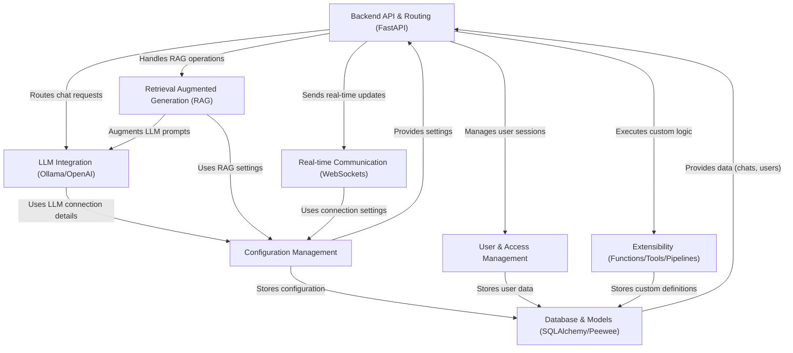

# Tutorial: Open WebUI

Open WebUI is a user-friendly web interface for interacting with various **Large Language Models (LLMs)** like those available through *Ollama* or *OpenAI*. It allows you to chat with models, manage them, and customize the experience. Key features include **Retrieval Augmented Generation (RAG)** to let models use your documents, **user management** for multi-user setups, real-time updates via **WebSockets**, and **extensibility** through custom tools and pipelines. The backend is built with *FastAPI* and uses a database (like *SQLite* or *PostgreSQL*) to store information.

**Source Repository:** [https://github.com/open-webui/open-webui](https://github.com/open-webui/open-webui)

## Chapters

1. [Configuration Management](01_configuration_management.md)
2. [Database & Models (SQLAlchemy/Peewee)](02_database___models__sqlalchemy_peewee_.md)
3. [LLM Integration (Ollama/OpenAI)](03_llm_integration__ollama_openai_.md)
4. [Backend API & Routing (FastAPI)](04_backend_api___routing__fastapi_.md)
5. [User & Access Management](05_user___access_management.md)
6. [Retrieval Augmented Generation (RAG)](06_retrieval_augmented_generation__rag_.md)
7. [Real-time Communication (WebSockets)](07_real_time_communication__websockets_.md)
8. [Extensibility (Functions/Tools/Pipelines)](08_extensibility__functions_tools_pipelines_.md)

---

Generated by [AI Codebase Knowledge Builder](https://github.com/The-Pocket/Tutorial-Codebase-Knowledge)